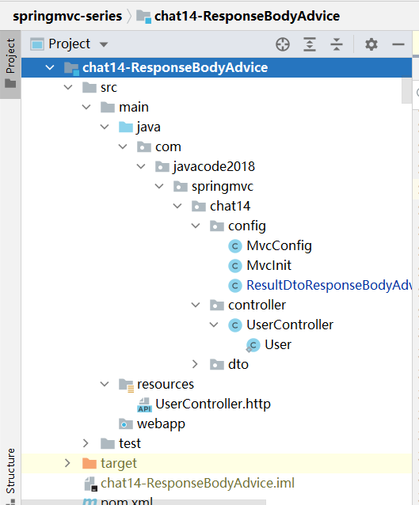
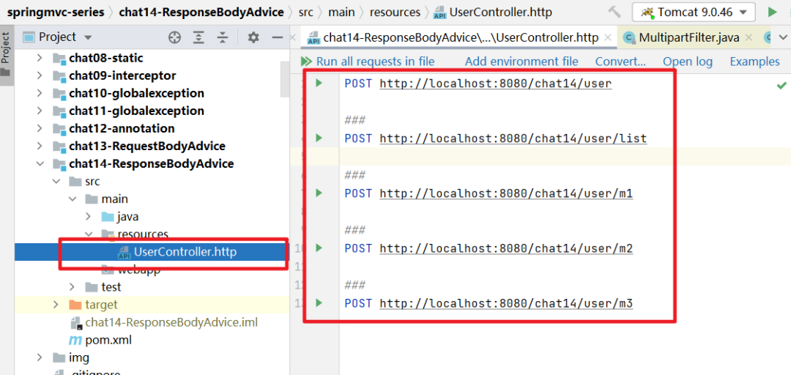
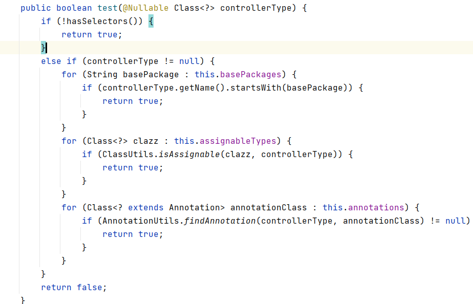

## 1、前言

上一篇中介绍了 RequestBodyAdvice 接口，可以对 @RequestBody 进行增强，本文介绍另外一个相似的接口：`ResponseBodyAdvice`，这个可以对 @ResponseBody 进行增强，可以拦截 @ResponseBody 标注的方法的返回值，对返回值进行统一处理，比如进行加密、包装等操作；比如通过他可以实现统一的返回值。

## 2、接口如何实现统一返回值？

要求系统中所有返回 json 格式数据的接口都需要返回下面格式的数据。

```
{
  "success": true,
  "code": null,
  "msg": "操作成功!",
  "data": 具体的数据
}
```

但是咱们系统中所有的接口返回值都是下面这种格式的，难道咱们要一个个去手动改一下接口的返回值么？


SpringMVC 为我们提供了更简单的方法，此时我们可以使用 RequestBodyAdvice 来实现，拦截所有 @ResponseBody 接口，将接口的返回值包装一下，包装为统一的格式返回，下面来看具体代码如何实现。

## 3、案例：通过 RequestBodyAdvice 实现统一返回值

### 3.1、git 代码位置

```
https://gitee.com/javacode2018/springmvc-series
```



### 3.2、定义返回值的通用类型

```
package com.javacode2018.springmvc.chat14.dto;

/**
 * rest接口通用返回值数据结构
 *
 * @param <T>
 */
public class ResultDto<T> {
    //接口状态（成功还是失败）
    private Boolean success;
    //错误码
    private String code;
    //提示信息
    private String msg;
    //数据
    private T data;

    public Boolean getSuccess() {
        return success;
    }

    public void setSuccess(Boolean success) {
        this.success = success;
    }

    public String getCode() {
        return code;
    }

    public void setCode(String code) {
        this.code = code;
    }

    public String getMsg() {
        return msg;
    }

    public void setMsg(String msg) {
        this.msg = msg;
    }

    public T getData() {
        return data;
    }

    public void setData(T data) {
        this.data = data;
    }

    public static <T> ResultDto<T> success(T data) {
        return success(data, "操作成功!");
    }

    public static <T> ResultDto<T> success(T data, String msg) {
        ResultDto<T> result = new ResultDto<>();
        result.setSuccess(Boolean.TRUE);
        result.setMsg(msg);
        result.setData(data);
        return result;
    }

    public static <T> ResultDto<T> error(String msg) {
        return error(null, msg);
    }

    public static <T> ResultDto<T> error(String code, String msg) {
        return error(code, msg, null);
    }

    public static <T> ResultDto<T> error(String code, String msg, T data) {
        ResultDto<T> result = new ResultDto<>();
        result.setSuccess(Boolean.FALSE);
        result.setCode(code);
        result.setMsg(msg);
        result.setData(data);
        return result;
    }
}
```

### 3.3、自定义一个 ResponseBodyAdvice

```
package com.javacode2018.springmvc.chat14.config;

import com.javacode2018.springmvc.chat14.dto.ResultDto;
import org.springframework.core.MethodParameter;
import org.springframework.core.io.Resource;
import org.springframework.http.MediaType;
import org.springframework.http.converter.HttpMessageConverter;
import org.springframework.http.server.ServerHttpRequest;
import org.springframework.http.server.ServerHttpResponse;
import org.springframework.web.bind.annotation.ControllerAdvice;
import org.springframework.web.servlet.mvc.method.annotation.ResponseBodyAdvice;

import java.util.HashSet;
import java.util.Set;

@ControllerAdvice
public class ResultDtoResponseBodyAdvice implements ResponseBodyAdvice<Object> {

    //不支持的类型列表
    private static final Set<Class<?>> NO_SUPPORTED_CLASSES = new HashSet<>(8);

    static {
        NO_SUPPORTED_CLASSES.add(ResultDto.class);
        NO_SUPPORTED_CLASSES.add(String.class);
        NO_SUPPORTED_CLASSES.add(byte[].class);
        NO_SUPPORTED_CLASSES.add(Resource.class);
        NO_SUPPORTED_CLASSES.add(javax.xml.transform.Source.class);
    }

    @Override
    public boolean supports(MethodParameter returnType, Class<? extends HttpMessageConverter<?>> converterType) {
        //如果返回值是NO_SUPPORTED_CLASSES中的类型，则不会被当前类的beforeBodyWrite方法处理，即不会被包装为ResultDto类型
        if (NO_SUPPORTED_CLASSES.contains(returnType.getParameterType())) {
            return false;
        } else {
            return true;
        }
    }

    @Override
    public Object beforeBodyWrite(Object body, MethodParameter returnType, MediaType selectedContentType, Class<? extends HttpMessageConverter<?>> selectedConverterType, ServerHttpRequest request, ServerHttpResponse response) {
        return ResultDto.success(body);
    }
}
```

需要实现 ResponseBodyAdvice 接口类上需要标注 @ControllerAdvice 注解 springmvc 内部会对 @ResponseBody 方法的返回值进行处理，会先调用 ResponseBodyAdvice 的 supports 方法，如果方法返回 true，则会进到其`beforeBodyWrite`方法中，我们在这个方法中将其包装为需求中统一的格式返回。大家需要注意 supports 方法，内部排除 NO_SUPPORTED_CLASSES 中指定的 5 种类型，这几种类型的返回值不会被处理。

### 3.4、来个 controller 测试效果

```
@RestController
public class UserController {
    @RequestMapping("/user")
    public User user() {
        return new User("路人", 30);
    }

    @RequestMapping("/user/list")
    public List<User> list() {
        List<User> result = Arrays.asList(new User("SpringMVC系列", 3), new User("SpringBoot系列", 2));
        return result;
    }

    @RequestMapping("/user/m1")
    public String m1() {
        return "ok";
    }

    @RequestMapping("/user/m2")
    public Integer m2() {
        return 1;
    }

    @RequestMapping("/user/m3")
    public ResultDto<String> m3() {
        return ResultDto.success("ok");
    }

    public static class User {
        private String name;
        private Integer age;

        public User() {
        }

        public User(String name, Integer age) {
            this.name = name;
            this.age = age;
        }

        public String getName() {
            return name;
        }

        public void setName(String name) {
            this.name = name;
        }

        public Integer getAge() {
            return age;
        }

        public void setAge(Integer age) {
            this.age = age;
        }

        @Override
        public String toString() {
            return "User{" +
                    "name='" + name + '\'' +
                    ", age=" + age +
                    '}';
        }
    }
}
```

controller 中定义了 5 个接口，来看看他们的返回值，顺便看下他们是否会被 ResultDtoResponseBodyAdvice 处理为统一的格式呢？

| 方法 / 接口 | 返回值       | 是否会被 ResultDtoResponseBodyAdvice 处理？ |
| ----------- | ------------ | ------------------------------------------- |
| /user       | User         | 是                                          |
| /user/list  | `List<User>` | 是                                          |
| /user/m1    | String       | 否                                          |
| /user/m2    | Integer      | 是                                          |
| /user/m3    | ResultDto    | 否                                          |

### 3.5、验证接口输出



**/user 接口：** 输出如下，说明被统一处理了

```
{
  "success": true,
  "code": null,
  "msg": "操作成功!",
  "data": {
    "name": "路人",
    "age": 30
  }
}
```

**/user/list 接口：** 输出如下，说明被统一处理了

```
{
  "success": true,
  "code": null,
  "msg": "操作成功!",
  "data": [
    {
      "name": "SpringMVC系列",
      "age": 3
    },
    {
      "name": "SpringBoot系列",
      "age": 2
    }
  ]
}
```

**/user/m1 接口：** 输出如下，说明没有被统一处理，直接将 controller 中方法返回的值直接输出了

```
ok
```

**/user/m2 接口：** 输出如下，说明也被统一处理了

```
{
  "success": true,
  "code": null,
  "msg": "操作成功!",
  "data": 1
}
```

**/user/m3 接口：** 直接返回的是 ResultDto 类型的，没有被统一处理

```
{
  "success": true,
  "code": null,
  "msg": "操作成功!",
  "data": "ok"
}
```

## 4、多个 ResponseBodyAdvice 指定顺序

当程序中定义了多个`ResponseBodyAdvice`，可以通过下面 2 种方式来指定顺序。

**方式 1**：使用`@org.springframework.core.annotation.Order`注解指定顺序，顺序按照 value 的值从小到大

**方式 2**：实现`org.springframework.core.Ordered`接口，顺序从小到大

## 5、@ControllerAdvice 指定增强的范围

@ControllerAdvice 注解相当于对 Controller 的功能进行了增强，目前来看，对所有的 controller 方法都增强了。

那么，能否控制一下增强的范围呢？比如对某些包中的 controller 进行增强，或者通过其他更细的条件来控制呢？

确实可以，可以通过 @ControllerAdvice 中的属性来指定增强的范围，需要满足这些条件的才会被 @ControllerAdvice 注解标注的 bean 增强，每个属性都是数组类型的，所有的条件是或者的关系，满足一个即可。

```
@Target(ElementType.TYPE)
@Retention(RetentionPolicy.RUNTIME)
@Documented
@Component
public @interface ControllerAdvice {

 /**
  * 用来指定controller所在的包，满足一个就可以
  */
 @AliasFor("basePackages")
 String[] value() default {};

 /**
  * 用来指定controller所在的包，满足一个就可以
  */
 @AliasFor("value")
 String[] basePackages() default {};

 /**
  * controller所在的包必须为basePackageClasses中同等级或者子包中，满足一个就可以
  */
 Class<?>[] basePackageClasses() default {};

 /**
  * 用来指定Controller需要满足的类型，满足assignableTypes中指定的任意一个就可以
  */
 Class<?>[] assignableTypes() default {};

 /**
  * 用来指定Controller上需要有的注解，满足annotations中指定的任意一个就可以
  */
 Class<? extends Annotation>[] annotations() default {};

}
```

**扩展知识**：这块的判断对应的源码如下，有兴趣的可以看看。

```
org.springframework.web.method.HandlerTypePredicate#test
```



## 6、ResponseBodyAdvice 原理

有些朋友可能对`@ControllerAdvice和ResponseBodyAdvice`的原理比较感兴趣，想研究一下他们的源码，关键代码在下面这个方法中，比较简单，有兴趣的可以去翻阅一下，这里就不展开说了。

```
org.springframework.web.servlet.mvc.method.annotation.RequestMappingHandlerAdapter#afterPropertiesSet
org.springframework.web.servlet.mvc.method.annotation.RequestMappingHandlerAdapter#initControllerAdviceCache
```

## 7、留个问题

当系统异常的时候，如何统一异常的输出呢？这里留给大家去思考一下，可以在留言中发表你的想法。
