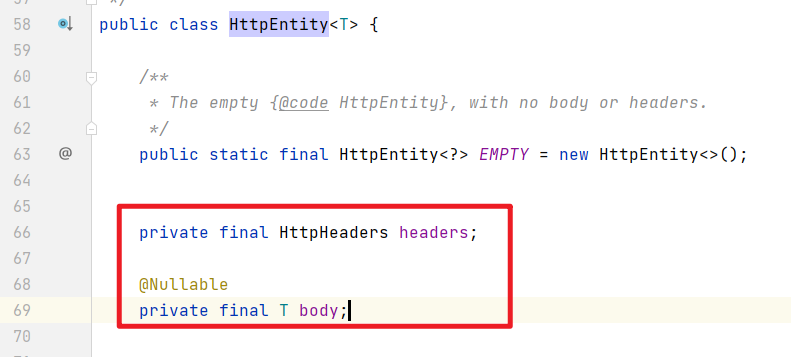
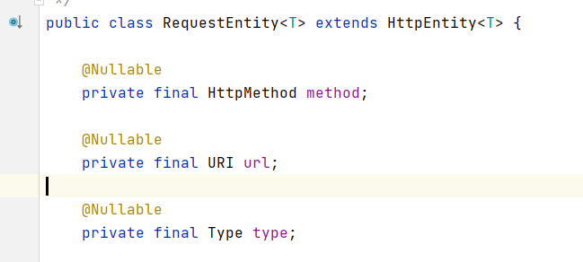
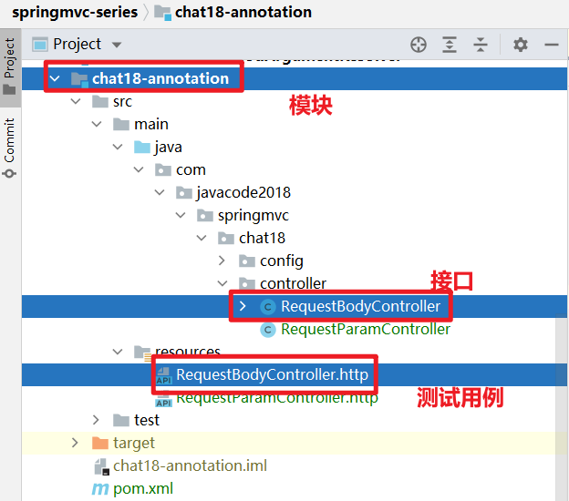

# @RequestBody解密，说点你不知道的

> 本文由 [简悦 SimpRead](http://ksria.com/simpread/) 转码， 原文地址 [mp.weixin.qq.com](https://mp.weixin.qq.com/s?__biz=MzA5MTkxMDQ4MQ==&mid=2648942842&idx=1&sn=720350110458eba38d89dd13c5b1042d&chksm=886230c4bf15b9d23dc8153d2fdbbda9d79c9dd30c48625aad2cba2e63b93744cc0abfd0b6b1&scene=178&cur_album_id=1873497824336658435#rd)


本文将介绍 @RequestBody 注解常见的一些用法和原理，这个注解日常用到的特别多。

1、预备知识
------

1.  [接口测试利器 HTTP Client](https://mp.weixin.qq.com/s?__biz=MzA5MTkxMDQ4MQ==&mid=2648940431&idx=1&sn=6c592aa2746fd448c1a6ef511189eaaa&scene=21#wechat_redirect)
    
2.  [参数解析器 HandlerMethodArgumentResolver 解密](https://mp.weixin.qq.com/s?__biz=MzA5MTkxMDQ4MQ==&mid=2648942681&idx=1&sn=eeea9d5d97e1cdd46a63cb1c953b5176&scene=21#wechat_redirect)
    

2、@RequestBody 介绍
-----------------

标注在接口的参数上，用来获取 HTTP 请求 body 中的值，下面通过案例列出常见的用法。

```java
@Target(ElementType.PARAMETER)
@Retention(RetentionPolicy.RUNTIME)
@Documented
public @interface RequestBody {

 /**
  * body是不是必须的，默认为true，若不传body，会有异常；若为false，这body可不传
  */
 boolean required() default true;

}
```


3、案例 1：使用字符串接收 body 中的数据
------------------------

### 3.1、接口代码

> 注意方法的参数，使用 @RequestBody 标注，参数类型是 String，表示以字符串的方式接收 body 的数据。

```java
@RequestMapping("/requestbody/test1")
public String test1(@RequestBody String body) {
    System.out.println("body:" + body);
    return "ok";
}
```

下面来模拟发送 5 种格式的数据，然后看控制台的输出。

### 3.2、用例 1：发送纯文本数据

> Content-Type 用来指定客户端发送的数据的类型。

```
### 发送纯文本
POST http://localhost:8080/chat18/requestbody/test1
Content-Type: text/plain

这里是body部分,欢迎访问我的博客：itsoku.com,上面有更多系列文章
```

运行，接口内部控制台输出

```
body:这里是body部分,欢迎访问我的博客：itsoku.com,上面有更多系列文章
```

### 3.3、用例 2：发送表单数据，相当于提交表单

> Content-Type: application/x-www-form-urlencoded 相当于页面中提交表单，表单中的所有元素会以 name=value&name=value 的方式拼接起来，然后在进行 urlencoded，之后丢在 body 中发送。

```
### 发送表单数据，相当于提交表单
POST http://localhost:8080/chat18/requestbody/test1
Content-Type: application/x-www-form-urlencoded

name=路人&blogs=itsoku.com
```

运行输出如下，可以看出来是乱码的格式，是由于被中文被 urlencoded 编码了。

```
body:name=%E8%B7%AF%E4%BA%BA&blogs=itsoku.com
```

### 3.4、用例 3：发送 xml 数据

```http
### 发送xml数据
POST http://localhost:8080/chat18/requestbody/test1
Content-Type: text/xml

<CourseList>
    <Course>Java高并发系列</Course>
    <Course>MyBatis系列</Course>
    <Course>MySQL系列</Course>
    <Course>Spring高手系列</Course>
    <Course>分布式事务高手系列</Course>
</CourseList>
```

运行，控制台输出

```java
body:<CourseList>
    <Course>Java高并发系列</Course>
    <Course>MyBatis系列</Course>
    <Course>MySQL系列</Course>
    <Course>Spring高手系列</Course>
    <Course>分布式事务高手系列</Course>
</CourseList>
```

### 3.5、用例 4：发送 json 数据

```
### 发送json数据
POST http://localhost:8080/chat18/requestbody/test1
Content-Type: application/json;charset=UTF-8

{
  "blog": "itsoku.com",
  "course": [
    "Spring高手系列",
    "MySQL系列",
    "高并发系列"
  ]
}
```

运行，控制台输出

```json
body:{
  "blog": "itsoku.com",
  "course": [
    "Spring高手系列",
    "MySQL系列",
    "高并发系列"
  ]
}
```

从上面可以看出，接口参数 body 的值为 http 请求 body 中的原始数据。

4、案例 2：使用对象接收 json 格式的数据
------------------------

### 4.1、用法

发送 json 格式的数据，这种用到的比较多，http 请求发送这种数据，有 3 点要求：

1.  Content-Type 的值需要为：application/json;charset=UTF-8，告诉服务器端客户端 body 中的数据是 json 格式 & UTF-8 编码
    
2.  body 中数据为 json 格式
    
3.  接口端用对象接收，参数使用 @RequestBody 标注
    

### 4.2、接口代码

```java
@RequestMapping("/requestbody/test2")
public String test2(@RequestBody User user) {
    System.out.println("user:" + user);
    return "ok";
}
```

User 类

```java
public class User {
    private String name;
    private Integer age;
    private List<String> skills;

    //省略get、set

    @Override
    public String toString() {
        return "User{" +
            " + name + '\'' +
            ", age=" + age +
            ", skills=" + skills +
            '}';
    }
}
```

### 4.3、调用接口

重点注意了，头中需要加上`Content-Type: application/json`

```
### 发送json数据，后端用对象接收
POST http://localhost:8080/chat18/requestbody/test2
Content-Type: application/json;charset=UTF-8

{
  "name": "路人",
  "age": 35,
  "skills": [
    "高并发",
    "Spring",
    "分布式事务",
    "MQ",
    "MySQL"
  ]
}
```

### 4.4、控制台输出

```
user:User{name='路人', age=35, skills=[高并发, Spring, 分布式事务, MQ, MySQL]}
```


5、案例 3：使用 Resource 资源对象接收
-------------------------

### 5.1、用法

有时候，我们想以流的方式接收 body 中的数据，那么可以参考下面的写法，参数类型为`[ByteArrayResource,InputStreamResource]这2种类型即可`，第一种类型获取的是一个字节数组，第二个是一个 InputStream 输入流。

比如我们需要快速上传文件到阿里云，那么接口接收到客户端的流之后，直接将流转发到 oss，效率更高。

```java
/**
 * 参数为如果为 org.springframework.core.io.Resource 类型，
 * 则只能为Resource的[ByteArrayResource,InputStreamResource]这2种子类型:
 *
 * @param body
 * @return
 * @throws IOException
 */
@RequestMapping("/requestbody/test3")
public String test3(@RequestBody InputStreamResource body) throws IOException {
    String content = IOUtils.toString(body.getInputStream(), "UTF-8");
    System.out.println("content:" + content);
    return "ok";
}
```

### 5.2、调用接口

```
### 后端使用Resource接收数据
POST http://localhost:8080/chat18/requestbody/test3
Content-Type: text/plain;charset=UTF-8

后端使用Resource接收数据
```

### 5.3、控制台输出

```
content:后端使用Resource接收数据
```

6、案例 4：以字节数组接受数据
----------------

### 6.1、代码

```java
/**
 * 使用字节数组接收
 *
 * @param bodyBytes
 * @return
 */
@RequestMapping("/requestbody/test4")
public String test4(@RequestBody byte[] bodyBytes) {
    System.out.println("body长度(bytes)：" + bodyBytes.length);
    System.out.println("body内容：" + new String(bodyBytes));
    return "ok";
}
```

### 6.2、调用接口

```
### 后端使用字节数组接收数据
POST http://localhost:8080/chat18/requestbody/test4
Content-Type: text/plain;charset=UTF-8

itsoku.com
```

### 6.3、控制台输出

```
body长度(bytes)：10
body内容：itsoku.com
```


7、案例 5：使用 HttpEntity 接收数据
-------------------------

### 7.1、HttpEntity：含有头和 body 信息

如果想同时拿到头和 body 的数据，可以使用，`org.springframework.http.HttpEntity`来接收数据，这个类中包含了头和 body 的信息，body 是一个泛型，http 请求的数据会被转换为 body 对应的 T 类型。



### 7.2、案例代码

> 注意：HttpEntity 类型的参数不要用 @RequestBody 标注。

```java
@RequestMapping("/requestbody/test5")
public String test5(HttpEntity<User> httpEntity) {
    //header信息
    HttpHeaders headers = httpEntity.getHeaders();
    System.out.println("headers:" + headers);
    //body中的内容会自动转换为HttpEntity中泛型指定的类型
    User user = httpEntity.getBody();
    System.out.println("body:" + user);
    return "ok";
}
```

### 7.3、调用案例接口

```json
### 发送json数据，后端用HttpEntity<User>接收
POST http://localhost:8080/chat18/requestbody/test5
Content-Type: application/json;charset=UTF-8

{
  "name": "路人",
  "age": 35,
  "skills": [
    "高并发",
    "Spring",
    "分布式事务",
    "MQ",
    "MySQL"
  ]
}
```

### 7.4、控制台输出

```
headers:[content-type:"application/json;charset=UTF-8", content-length:"130", host:"localhost:8080", connection:"Keep-Alive", user-agent:"Apache-HttpClient/4.5.12 (Java/11.0.10)", accept-encoding:"gzip,deflate"]
body:User{name='路人', age=35, skills=[高并发, Spring, 分布式事务, MQ, MySQL]}
```


8、案例 6：使用 RequestEntity 接受数据
----------------------------

### 8.1、RequestEntity：包含更多请求信息（头、method、url，body）

RequestEntity 的用法和案例 5 中的 HttpEntity 用法类似，RequestEntity 继承了 HttpEntity，包含了更多的信息，比`RequestEntity`多了 2 个 http 请求信息（method 和 url）



### 8.2、案例代码

```java
@RequestMapping("/requestbody/test6")
public String test6(RequestEntity<User> requestEntity) {
    //请求方式
    HttpMethod method = requestEntity.getMethod();
    System.out.println("method:" + method);
    //请求地址
    URI url = requestEntity.getUrl();
    System.out.println("url:" + url);
    //body的类型，即RequestEntity后面尖括号中的类型
    Type type = requestEntity.getType();
    System.out.println("body的类型，即RequestEntity后面尖括号中的类型:" + type);
    //header信息
    HttpHeaders headers = requestEntity.getHeaders();
    System.out.println("headers:" + headers);
    //body中的内容会自动转换为HttpEntity中泛型指定的类型
    User user = requestEntity.getBody();
    System.out.println("body:" + user);
    return "ok";
}
```

### 8.3、调用案例接口

```
### 发送json数据，后端用对象接收
POST http://localhost:8080/chat18/requestbody/test6
Content-Type: application/json;charset=UTF-8

{
  "name": "路人",
  "age": 35,
  "skills": [
    "高并发",
    "Spring",
    "分布式事务",
    "MQ",
    "MySQL"
  ]
}


```

### 8.4、控制台输出

```java
method:POST
url:http://localhost:8080/chat18/requestbody/test6
body的类型，即RequestEntity后面尖括号中的类型:class com.javacode2018.springmvc.chat18.controller.RequestBodyController$User
headers:[content-type:"application/json;charset=UTF-8", content-length:"130", host:"localhost:8080", connection:"Keep-Alive", user-agent:"Apache-HttpClient/4.5.12 (Java/11.0.10)", accept-encoding:"gzip,deflate"]
body:User{name='路人', age=35, skills=[高并发, Spring, 分布式事务, MQ, MySQL]}
```

9、@RequestBody 还可以如何使用呢？
------------------------

这里留给大家去研究，大家在运行一下案例 1 中的用例 1

```
### 发送纯文本
POST http://localhost:8080/chat18/requestbody/test1
Content-Type: text/plain

这里是body部分,欢迎访问我的博客：itsoku.com,上面有更多系列文章
```

控制台有更详细的输出如下，注意里面的`RequestResponseBodyMethodProcessor`，这个就是`@ReqeustBody`类型的参数处理器，`@ReqeustBody`标注的参数的值都是有这个类来解析请求得到的，大家可以去看看这个类的代码，debug 一番，就知道 `@ReqeustBody` 还有那些更炫的用法了。

```
23:17:05.595 [http-nio-8080-exec-9] DEBUG org.springframework.web.servlet.DispatcherServlet - POST "/chat18/requestbody/test1", parameters={}
23:17:05.595 [http-nio-8080-exec-9] DEBUG org.springframework.web.servlet.mvc.method.annotation.RequestMappingHandlerMapping - Mapped to com.javacode2018.springmvc.chat18.controller.RequestBodyController#test1(String)
23:17:05.596 [http-nio-8080-exec-9] DEBUG org.springframework.web.servlet.mvc.method.annotation.RequestResponseBodyMethodProcessor - Read "text/plain;charset=UTF-8" to ["这里是body部分,欢迎访问我的博客：itsoku.com,上面有更多系列文章"]
body:这里是body部分,欢迎访问我的博客：itsoku.com,上面有更多系列文章
23:17:05.597 [http-nio-8080-exec-9] DEBUG org.springframework.web.servlet.mvc.method.annotation.RequestResponseBodyMethodProcessor - Using 'text/plain', given [*/*] and supported [text/plain, */*, application/json, application/*+json]
23:17:05.597 [http-nio-8080-exec-9] DEBUG org.springframework.web.servlet.mvc.method.annotation.RequestResponseBodyMethodProcessor - Writing ["ok"]
23:17:05.598 [http-nio-8080-exec-9] DEBUG org.springframework.web.servlet.DispatcherServlet - Completed 200 OK

```

> 主要有 5 行日志，每行日志这里做一下解释
>
> 第 1 行：接收到了请求，请求的信息（url，参数）
>
> 第 2 行：找到了能够处理请求的方法，即 RequestBodyController#test1(String) 方法可以处理当前请求
>
> 第 3 行：参数解析器，@RequestBody 对应的是 RequestResponseBodyMethodProcessor
>
> 第 4 行：接口中 System.out.println 输出的内容
>
> 第 5 行：返回值处理器，这个以后会有专题讲解

10、@RequestBody 原理
------------------

@RequestBody 标注的参数取值是由`RequestResponseBodyMethodProcessor#resolveArgument`方法处理的，可以去看源码。

11、代码位置及说明
----------

### 11.1、git 地址

https://gitee.com/javacode2018/springmvc-series


### 11.2、本文案例代码结构说明



6.  