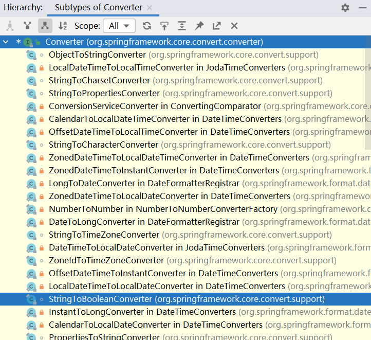
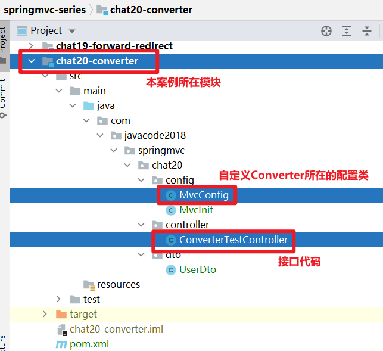

# SpringBoot中的Converter解密，强大！

> 本文由 [简悦 SimpRead](http://ksria.com/simpread/) 转码， 原文地址 [mp.weixin.qq.com](https://mp.weixin.qq.com/s?__biz=MzA5MTkxMDQ4MQ==&mid=2648944077&idx=1&sn=a206f0b46eb6d400359107623a407225&chksm=886235f3bf15bce565692c397c5ca2e3c2500a935b640506894dfd999cf5cc95c0455cea3078&scene=178&cur_album_id=1873497824336658435#rd)

**大家好，我是路人，这是 SpringMVC 系列第 30 篇。**

本文将讲解 Spring 中的另外一个知识点：SpringMVC 中转换器`Converter`的使用。

好陌生啊，这玩意是干啥的呢？请往下看。

1、来看一个需求
--------

如下，有一个 UserDto 类，表示用户信息

```java
public class UserDto {
    //用户名
    private String name;
    //年龄
    private Integer age;

    //省略getter、setter方法
}
```

要求后台所有接口接受`UserDto`数据时，参数的值格式为：`name,age`，比如下面接口

```java
@RequestMapping("/convert/test1")
public UserDto test1(@RequestParam("user") UserDto user) {
    System.out.println("name：" + user.getName());
    System.out.println("age：" + user.getAge());
    return user;
}
```

能够接受的请格式：`/convert/test1?user=ready,1`，这种需求如何实现呢？

2、需用 Converter 接口来实现
--------------------

SpringMVC 中为我们提供的另外一个接口`org.springframework.core.convert.converter.Converter`，这个接口用来将一种类型转换为另一种类型，看看其源码如下，调用后端接口的时候，http 传递的参数都是字符串类型的，但是后端却可以使用 Integer、Double 等其他类型来接收，这就是`Converter`实现的。

```java
@FunctionalInterface
public interface Converter<S, T> {

 /**
  * 将source转换为目标T类型
  */
 @Nullable
 T convert(S source);
}
```

Spring 内部提供了很多默认的实现，用于各种类型转换



实现开头的需求，需要我们自定义一个 Converter<String,UserDto>，将其添加到 SpringMVC 转换器列表中，他负责将 String 类型转换为 UserDto 类型。下面来看具体代码实现

3、代码实现
------

*   代码如下，添加一个配置类，实现`WebMvcConfigurer`接口
    
*   重写`addFormatters`方法，在这个方法中添加一个自定义的`Converter`，实现其 convert 方法，将`name,age`格式的字符串转换为 UserDto 对象返回
    

```java
@Configuration
public class MvcConfig implements WebMvcConfigurer {

    @Override
    public void addFormatters(FormatterRegistry registry) {
        registry.addConverter(new Converter<String, UserDto>() {
            @Override
            public UserDto convert(String source) {
                if (source == null) {
                    return null;
                }
                String[] split = source.split(",");
                String name = split[0];
                Integer age = Integer.valueOf(split[1]);
                return new UserDto(name, age);
            }
        });
    }
}
```

接口代码

```java
@RestController
public class ConverterTestController {

    @RequestMapping("/convert/test1")
    public UserDto test1(@RequestParam("user") UserDto user) {
        System.out.println("name：" + user.getName());
        System.out.println("age：" + user.getAge());
        return user;
    }

}
```

访问请求`/convert/test1?user=ready,1`，效果如下：


tomcat 控制台输出

```
name：ready
age：1
```

4、案例代码 git 地址
-------------

### 4.1、git 地址

https://gitee.com/javacode2018/springmvc-series


### 4.2、本文案例代码结构说明



