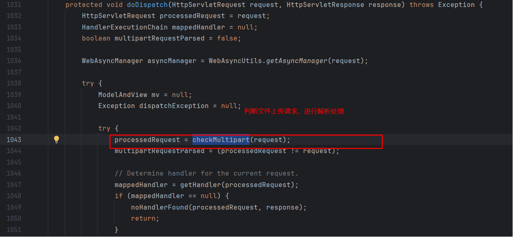

[web.xml详解 及 web.xml模板 - mellisa&myt - 博客园](https://www.cnblogs.com/mytJava/p/13143449.html)

[web.xml文件的作用及基本配置](https://www.jianshu.com/p/285ad45f60d1)

[springmvc--拦截器的preHandler返回false后的执行顺序 - Gavin_Yi - 博客园](https://www.cnblogs.com/gavin2016/p/6553880.html)


路人甲java # SpringMVC 系列


# 文件上传

## 环境准备

### 依赖引入

```xml
        <dependency>
            <groupId>org.springframework</groupId>
            <artifactId>spring-webmvc</artifactId>
            <version>5.3.23</version>
        </dependency>

        <dependency>
            <groupId>javax.servlet</groupId>
            <artifactId>javax.servlet-api</artifactId>
            <version>4.0.1</version>
        </dependency>
<!--        文件上传需要的依赖-->
        <dependency>
            <groupId>commons-io</groupId>
            <artifactId>commons-io</artifactId>
            <version>2.4</version>
        </dependency>

        <!--        文件上传需要的依赖-->
        <dependency>
            <groupId>commons-fileupload</groupId>
            <artifactId>commons-fileupload</artifactId>
            <version>1.4</version>
        </dependency>
```

### 定义 Spring Bean MultipartResolver 

```xml
    // 声明一个 MultipartResolver 的实现bean,并且设置Bean id 为 multipartResolver
    <bean id="multipartResolver" class="org.springframework.web.multipart.commons.CommonsMultipartResolver">
        <property name="defaultEncoding" value="UTF-8"/>
        <property name="maxUploadSize" value="5242880"/>
    </bean>
```

## 单文件上传

```java
    @PostMapping("singleUpload")
    @ResponseBody
    public void upload(MultipartFile file, String username, Integer age) {
        System.out.println("username = " + username);
        System.out.println("age = " + age);
        System.out.println(file.getOriginalFilename());
        System.out.println(file.getSize());
        System.out.println(file.getContentType());
        System.out.println(file.getName());
        try {
            file.transferTo(new File("E:\\test\\" + file.getOriginalFilename()));
        } catch (IOException e) {
            throw new RuntimeException(e);
        }
    }
```

## 多文件上传

```java
    @PostMapping("multiUpload")
    @ResponseBody
    public void upload(MultipartFile file1, MultipartFile file2, String username, Integer age) {
        System.out.println("username = " + username);
        System.out.println("age = " + age);
        System.out.println("file1.getOriginalFilename() = " + file1.getOriginalFilename());
        System.out.println("file2.getOriginalFilename() = " + file2.getOriginalFilename());
        try {
            file1.transferTo(new File("E:\\test\\" + file1.getOriginalFilename()));
            file2.transferTo(new File("E:\\test\\" + file2.getOriginalFilename()));
        } catch (IOException e) {
            throw new RuntimeException(e);
        }
    }
```

## 通过 `MultipartHttpServletRequest` 处理文件上传

```java
    @PostMapping("upload3")
    @ResponseBody
    public void upload(MultipartHttpServletRequest request) {
        // 处理非文件
        Map<String, String[]> parameterMap = request.getParameterMap();
        for (Map.Entry<String, String[]> stringEntry : parameterMap.entrySet()) {
            String parameter = stringEntry.getKey();
            String[] value = stringEntry.getValue();
            System.out.println("parameter = " + parameter);
            System.out.println("value = " + value);
        }

        // 处理文件
        MultiValueMap<String, MultipartFile> multiFileMap = request.getMultiFileMap();
        for (Map.Entry<String, List<MultipartFile>> stringListEntry : multiFileMap.entrySet()) {
            List<MultipartFile> value = stringListEntry.getValue();
            for (MultipartFile multipartFile : value) {
                System.out.println("multipartFile.getOriginalFilename() = " + multipartFile.getOriginalFilename());
                try {
                    multipartFile.transferTo(new File("E:\\test\\" + multipartFile.getOriginalFilename()));
                } catch (IOException e) {
                    throw new RuntimeException(e);
                }
            }
        }
    }
```

## 通过自定义对象接收上传的文件

```java
    @PostMapping("upload4")
    @ResponseBody
    public void upload(FormInput input) {
        String username = input.getUsername();
        System.out.println("username = " + username);
        Integer age = input.getAge();
        System.out.println("age = " + age);

        MultipartFile file1 = input.getFile1();
        System.out.println("file1.getOriginalFilename() = " + file1.getOriginalFilename());
        MultipartFile file2 = input.getFile2();
        System.out.println("file2.getOriginalFilename() = " + file2.getOriginalFilename());
        try {
            file1.transferTo(new File("E:\\test\\" + file1.getOriginalFilename()));
            file2.transferTo(new File("E:\\test\\" + file2.getOriginalFilename()));
        } catch (IOException e) {
            throw new RuntimeException(e);
        }
    }
```


## 扩展：为什么bean的名称是 multipartResolver

在 SpringMVC 中会使用 `MultipartResolver` 来解析上传文件的请求，具体代码在` org.springframework.web.servlet.DispatcherServlet#doDispatch` 中：



在 `checkMultipart(request) `中，会判断 `this.multipartResolver` 是不是为 null，如果为 null 就不会处理了，如果不为空，会调用  `this.multipartResolver.resolveMultipart(request)` 进行处理

```java
// 代码位置：org.springframework.web.servlet.DispatcherServlet#checkMultipart
// Convert the request into a multipart request, and make multipart resolver available. 
// If no multipart resolver is set, simply use the existing request.
protected HttpServletRequest checkMultipart(HttpServletRequest request) throws MultipartException {
		if (this.multipartResolver != null && this.multipartResolver.isMultipart(request)) {
			if (WebUtils.getNativeRequest(request, MultipartHttpServletRequest.class) != null) {
				if (DispatcherType.REQUEST.equals(request.getDispatcherType())) {
					logger.trace("Request already resolved to MultipartHttpServletRequest, e.g. by MultipartFilter");
				}
			}
			else if (hasMultipartException(request)) {
				logger.debug("Multipart resolution previously failed for current request - " +
						"skipping re-resolution for undisturbed error rendering");
			}
			else {
				try {
                    // kui：对request进行解析处理
					return this.multipartResolver.resolveMultipart(request);
				}
				catch (MultipartException ex) {
					if (request.getAttribute(WebUtils.ERROR_EXCEPTION_ATTRIBUTE) != null) {
						logger.debug("Multipart resolution failed for error dispatch", ex);
						// Keep processing error dispatch with regular request handle below
					}
					else {
						throw ex;
					}
				}
			}
		}
		// If not returned before: return original request.
		return request;
	}
```

这里需要看一下 `this.multipartResolver` 是怎么来的。在 DispatcherServlet 中，通过调用 `initMultipartResolver(ApplicationContext context)` 给 `this.multipartResolver` 设置的值。 

从Spring 容器中，通过Bean名称（multipartResolver）获取到的MultipartResolver Bean对象。这也是为什么声明的Bean名称为什么为"multipartResolver"

```java
// 代码位置：org.springframework.web.servlet.DispatcherServlet#initMultipartResolver
private void initMultipartResolver(ApplicationContext context) {
try {
    // 从 Spring容器中通过Bean名称获取MultipartResolver Bean，其中 MULTIPART_RESOLVER_BEAN_NAME = "multipartResolver"
    this.multipartResolver = context.getBean(MULTIPART_RESOLVER_BEAN_NAME, MultipartResolver.class);
    if (logger.isTraceEnabled()) {
        logger.trace("Detected " + this.multipartResolver);
    }
    else if (logger.isDebugEnabled()) {
        logger.debug("Detected " + this.multipartResolver.getClass().getSimpleName());
    }
}
catch (NoSuchBeanDefinitionException ex) {
    // Default is no multipart resolver.
    this.multipartResolver = null;
    if (logger.isTraceEnabled()) {
        logger.trace("No MultipartResolver '" + MULTIPART_RESOLVER_BEAN_NAME + "' declared");
    }
}
}
```