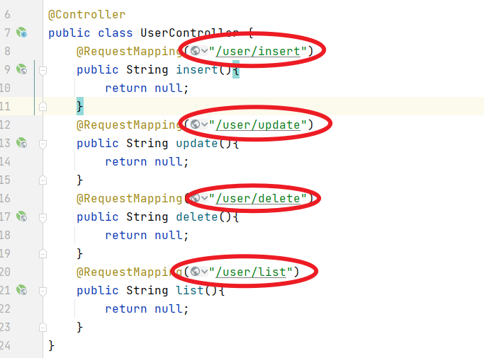
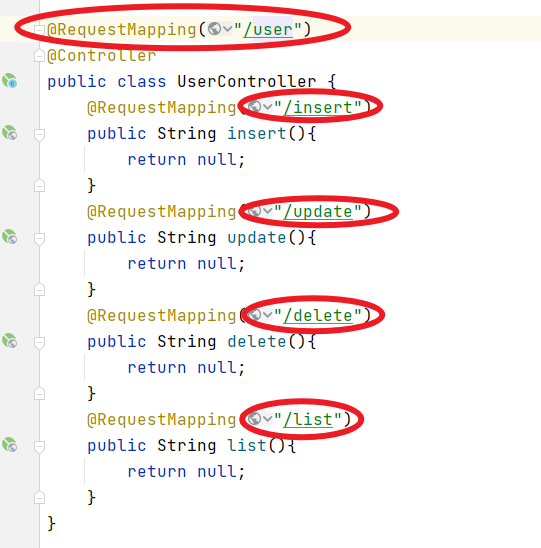

# SpringMVC系列第2篇：@Controller、@RequestMapping

本文由 [简悦 SimpRead](http://ksria.com/simpread/) 转码， 原文地址 [mp.weixin.qq.com](https://mp.weixin.qq.com/s?__biz=MzA5MTkxMDQ4MQ==&mid=2648940284&idx=1&sn=bd5437286f15e641e8c897d83c849ab8&chksm=886206c2bf158fd4f84a754f961990bd278b0cec839a5d5bb849fb763a72dedafae0eda7d281&scene=178&cur_album_id=1873497824336658435#rd)

## @Controller

用来标注在类上，表示这个类是一个控制器类，可以用来处理 http 请求，通常会和 @RequestMapping 一起使用。

源码如下，这个注解上面有 `@Component` 注解，说明被 `@Controller` 标注的类会被注册到 Spring 容器中，`value` 属性用来指定这个 bean 的名称，也可以不指定，由容器自动生成。

```java
@Target({ElementType.TYPE})
@Retention(RetentionPolicy.RUNTIME)
@Documented
@Component
public @interface Controller {

    @AliasFor(annotation = Component.class)
    String value() default "";

}
```

## @RequestMapping

### 作用

表示请求映射，一般用在我们自定义的 Controller 类上或者 Controller 内部的方法上。

通过这个注解指定配置一些规则，满足这些规则的请求会被标注了 `@RequestMapping` 的方法处理。

### 源码

源码如下，包含了 8 个属性，这些属性都是用来配置规则的，大家通过名称的基本上可以知道每个属性是来配置哪些规则的。

```java
@Target({ElementType.TYPE, ElementType.METHOD})
@Retention(RetentionPolicy.RUNTIME)
@Documented
@Mapping
public @interface RequestMapping {

    String name() default "";

    @AliasFor("path")
    String[] value() default {};

    @AliasFor("value")
    String[] path() default {};

    RequestMethod[] method() default {};

    String[] params() default {};

    String[] headers() default {};

    String[] produces() default {};

}
```

### 规则匹配原理

当 springmvc 容器启动时，会扫描标注有 @Controller 注解的类，将这些 Controller 中标注有 @RequestMapping 的方法收集起来，得到一个 Map<@RequestMapping,Method>（@RequestMapping 和方法的映射），当一个请求到达 DispatcherServlet 的时候，其内部会根据请求的信息（url、参数、header、请求的类型【通过头中的 Content-type 指定】、可以接受的类型【可以通过头中的 Accept 指定】）去这个 Map 中和 @RequestMapping 中的规则进行匹配，从而得到可以处理这个请求的方法，然后进行调用，所有的 @RequestMapping 都匹配失败的时候，会返回 404

### 通过 @RequestMapping 可配置 6 种规则

@RequestMapping 支持 6 种规则，这些规则都是通过 @RequestMapping 中的属性进行配置的，多个属性的值是 AND 关系

#### 规则 1：通过 value和 path 来限制请求地址

**用法**

可以指定 value、path 这 2 个属性中的任意一个，作用是一样的，用来对请求的 url 进行限制。

**多个值的关系**

这几个属性的类型都是 String 类型的数组，说明可以指定多个值，多个值之间是 OR 关系。

**案例**

| url 的值                       | 说明                                                   |
| ------------------------------ | ------------------------------------------------------ |
| {"/user/insert"}               | 可以处理 / user/insert 这个请求                        |
| {"/user/list","/user/getList"} | 可以同时处理 / user/list 和 / user/getList 这 2 个请求 |

#### 规则 2：通过 header 属性来限制请求头

**用法**

通过 header 属性来对请求中的 header 进行限制，比如我们希望请求中必须必须携带 token 这个头，那么就可以使用这个。

**多个值的关系**

AND 关系

**案例**

| header 的值              | 说明                                                         |
| ------------------------ | ------------------------------------------------------------ |
| {“header1”}              | 请求的 header 中必须有 header1 这个头，值随意                |
| {“header1=v1”}           | 必须包含 header1 为 v1 的头                                  |
| {“!header1}              | 这里用到了! 符号，表示头中不能有 header1 这个头              |
| {“header1”,“header2=v2”} | header 的值是 and 关系，所以这个值表示：头中必须包含 header1 以及 header2，且 header2 的值为 v2 |

#### 规则 3：通过 params 属性来限制请求参数

**用法**

通过 params 属性来限制请求中的参数，比如我们希望请求中必须有某些指定的参数时，才能被指定的方法处理，可以使用这个。

**多个值的关系**

AND 关系

**案例**

| params 的值      | 说明                                                |
| ---------------- | --------------------------------------------------- |
| {"name"}         | 请求中必须包含 name 参数，值随意                    |
| {"name = 路人"}  | 请求中必须包含name这个参数，且值必须是路人          |
| {“name","age=1"} | 请求中必须包含参数 name 和参数 age，且 age 的值为 1 |
| {"!age"}         | 请求中不能有参数 age                                |

#### 规则 4：通过 method 属性来限制 http 请求额方法

**用法**

如果需要限制某个方法只能处理 http 的 post 请求，那么就可以通过 method 属性来进行设置，如果不指定 method 的值，表示对 http 请求额 method 无限制。

**多个值的关系**

OR 关系

**案例**

| method 的值 | 说明                     |
| ----------- | ------------------------ |
| {POST}      | 只能接受 post 请求       |
| {POST,GET}  | post、get 请求都可以处理 |

#### 规则 5：通过 consumes 属性来限制请求的类型

**Content-Type 是什么**

熟悉 http 请求的朋友应该对 Content-Type 这个属性比较眼熟吧，这个属性是用来做什么的？

Content-Type 用来指定 http 请求中 body 的数据的类型，是 Json 呢？还是文本呢？还是图片、pdf 呢？

这些就可以通过 Content-Type 来进行指定，这样服务器接受到请求的时候，就知道 body 中数据的类型了，比如 `application/json`，就表示 body 中是一个 json 数据，那么服务器就可以以 json 的方式来解析 body 中的数据。以下是几个常见的：

| Content-Type 的值                 | 说明                                                         |
| --------------------------------- | ------------------------------------------------------------ |
| application/x-www-form-urlencoded | 这个是我们最常见的，通常我们在页面中通过 post 方式来提交一个表单，那么这个请求的类型就是这种 |
| multipart/form-data               | 通过表单上传文件用的就是这种类型，这种表示请求的 body 有多部分组成 |
| application/json                  | 表示 body 中的数据是一个 json 格式的数据                     |
| image/gif                         | 表示 body 中的数据是 gif 图片                                |

`Content-Type` 通常有主类型和子类型，中间通过 / 分割，这里就不详细展开了，有兴趣的朋友可以去百度专门研究下。

**consumes 属性用法**

@RquestMapping 中的 consumers 就是用来对 Content-Type 进行限制。

**多个值的关系**

OR 关系

**案例**

| consumes 的值                         | 说明                                                         |
| ------------------------------------- | ------------------------------------------------------------ |
| {"application/x-www-form-urlencoded"} | 请求中 Content-Type 的类型必须是 application/x-www-form-urlencoded 类型 |
| {"application/*"}                     | Content-Type 的类型必须是 application 类型的，比如：application/json、application/pdf、application/x-www-form-urlencoded |
| {"image/gif", "image/png"}            | Content-Type 的可以是 ["image/gif", "image/png"] 中的任意一种 |

#### 规则 6：通过 produces 属性来限制客户端可以接受的类型

**Accept 是什么？**

熟悉 http 请求的朋友应该对 Accept 这个属性比较眼熟吧，这个属性是用来做什么的？

和 Content-Type 刚好相反，Content-Type 用来指定客户端发送的数据的类型，而 **Accept 是用来指定客户端希望接受的数据的类型的**。

比如客户端希望服务器端返回 json 格式的数据，那么可以这么指定：`Accept: application/json`

值可以 Content-Type 的值类似，这里就不举例了。

**produces 属性用法**

指定返回的内容类型，仅当 request 请求头中的 (Accept) 类型中包含该指定类型才返回。

**多个值的关系**

OR 关系

**案例**

| produces 的值              | 说明                                                         |
| -------------------------- | ------------------------------------------------------------ |
| {"application/json"}       | 服务器端支持返回 application/json 类型数据，所以要求 Accept 也可以接受这种类型的数据 |
| {"image/gif", "image/png"} | 服务器端支持返回 ["image/gif", "image/png"] 中其中一种类型数据，所以要求 Accept 也可以接受这 2 中种类型中任意一种就可以 |

### 6 种规则对照表

| 属性        | 多个值之间的关系 | 说明                                             |
| ----------- | ---------------- | ------------------------------------------------ |
| value、path | OR               | 限制 url                                         |
| header      | AND              | 限制请求头                                       |
| params      | AND              | 限制请求的参数                                   |
| method      | OR               | 限制 http 请求的 method                          |
| consumes    | OR               | 限制 Content-Type 的类型（客户端发送数据的类型） |
| produces    | OR               | 限制 Aceept 的类型（客户端可接受数据的类型）     |

## 其他几个注解

| 注解           | 相当于                                       |
| -------------- | -------------------------------------------- |
| @PostMapping   | @RequestMapping(method=RequestMethod.POST)   |
| @GetMapping    | @RequestMapping(method=RequestMethod.GET)    |
| @DeleteMapping | @RequestMapping(method=RequestMethod.DELETE) |
| @PutMapping    | @RequestMapping(method=RequestMethod.PUT)    |

## @RequestMapping 用在类上

### 作用

用于将方法上 @RequestMapping 共有的规则提取出来，放在类上，起到重用的作用，可以简化代码。

### 案例

如下图的 controller 中有 4 个方法都有 @RequestMapping，他们的 value 属性的值都以`/user`开头，那么我们就可以将这部分提取出来放在这个类上面。



简化之后，变成了下面这样，将他们共有的部分提取到类上的 @RequestMapping 中了，起到了共用的作用。



## SpringMVC 系列源码

https://gitee.com/javacode2018/springmvc-series

## 总结

@RequestMaping 中 value、path、consumers、producers 稍微用到的多一些，其他几个属性用到的比较少，了解即可。

关于 6 种规则，大家可以自己去试试，会 springboot 的朋友，可以直接使用 springboot 快速写一些用例结合 postman 测试下，加深记忆和理解。

