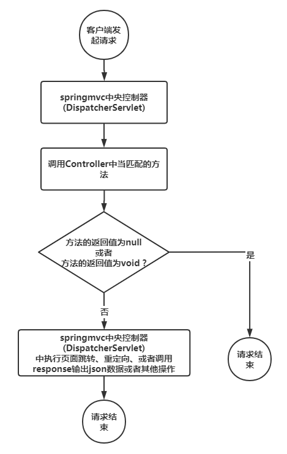

## 1、回顾一下

目前为止，springmvc 系列中，已经介绍了大量 Controller 的用法，大家有没有注意到，目前所有 controller 中的方法接收到请求之后，都是有返回值的，返回值主要有 2 种类型：

1、 输出的是页面：也就是视图（会向客户端输出页面），此时方法的返回值可以是 String（视图名称）、ModelAndView（页面中有数据的情况）

2、输出的是 json 格式的数据：需要用到 @ResponseBody 注解

这 2 种情况中，都是 springmvc 来处理返回值的，接受到返回值之后，会调用 response 来进行页面跳转或者调用输出流将 json 格式的数据输出。

## 2、思考一个问题

当方法的返回值为 void 或者方法中返回 null 的时候，springmvc 会怎么处理呢？

比如下面 2 个方法：

```
@GetMapping("/test1")
public void test(){
}

@GetMapping("/test1")
public Object test(){
 return null;
}
```

**当出现上面这 2 种情况的时候，springmvc 调用这些方法之后，请求就结束了，springmvc 会认为在控制器的方法中响应已经被处理过了，不需要 springmvc 去处理了。**

## 3、springmvc 的处理流程





## 4、使用场景

当响应结果比较复杂的时候，springmvc 无法处理这些响应结果的时候，我们可以在控制器的方法中使用 response 来主动控制输出的结果。

比如下载文件、断点下载文件等比较复杂的响应，此时我们可以在处理器的方法中使用 HttpServletResponse 来自己控制输出的内容，可以执行更细粒度的操作。

## 5、总结

到目前我们主要掌握了 3 种类型的返回值，工作中基本上最常用的就是这 3 种方式，咱们要掌握好：

- 第 1 种：返回视图，即页面，此时返回值可以是 String（视图名称）、或者 ModelAndView
- 第 2 种：返回 json 格式数据，需在方法上添加 @ResponseBody 注解
- 第 3 种：方法返回值为 void 或者 return null；此时需要我们在方法中自己通过 HttpServletResponse 对象来主动向客户端输出结果。

## 6、案例代码

```
git地址：https://gitee.com/javacode2018/springmvc-series
```