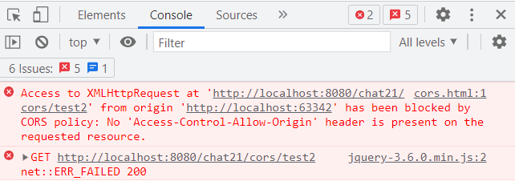
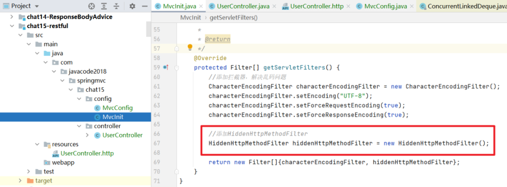
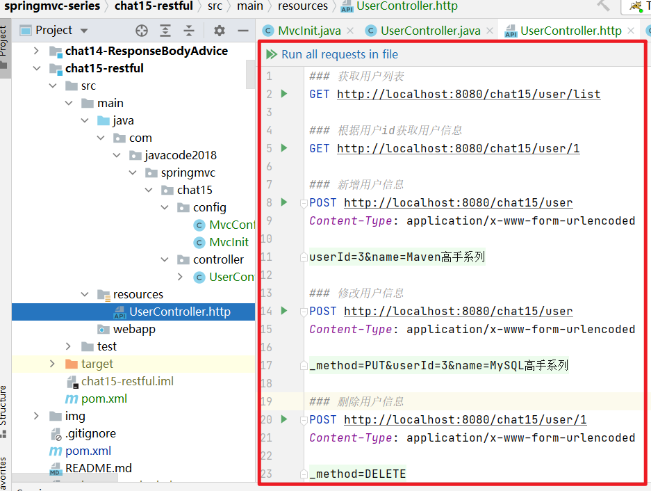

# 一文搞懂 restfull 接口开发

> 本文由 [简悦 SimpRead](http://ksria.com/simpread/) 转码， 原文地址 [mp.weixin.qq.com](https://mp.weixin.qq.com/s?__biz=MzA5MTkxMDQ4MQ==&mid=2648942113&idx=1&sn=97c4c7c2b19adcfad7694b954093e090&chksm=88623e1fbf15b7095e31599b6f85daf69a11147909b13f9f5a41410ec82bf53714b064f4e24a&scene=178&cur_album_id=1873497824336658435#rd)

本文主要 2 个主题：介绍 RESTful、SpringMVC 中 RESTful 案例。

目录
--

*   1、RESTful 简介
*   2、RESTful 的实现
*   3、HiddenHttpMethodFilter
*   4、RESTful 案例
    
*   4.1、需求
*   4.2、git 代码位置
*   4.3、UserController
*   4.4、添加 HiddenHttpMethodFilter
*   4.5、测试效果
*   5、SpringMVC 系列目录

1、RESTful 简介
------------

REST：Representational State Transfer，表现层资源状态转移。

**a > 资源**

资源是一种看待服务器的方式，即，将服务器看作是由很多离散的资源组成。每个资源是服务器上一个可命名的抽象概念。因为资源是一个抽象的概念，所以它不仅仅能代表服务器文件系统中的一个文件、数据库中的一张表等等具体的东西，可以将资源设计的要多抽象有多抽象，只要想象力允许而且客户端应用开发者能够理解。与面向对象设计类似，资源是以名词为核心来组织的，首先关注的是名词。一个 资源可以由一个或多个 URI 来标识。**URI 既是资源的名称，也是资源在 Web 上的地址**。对某个资源感兴趣的客户端应用，可以通过资源的 URI 与其进行交互。

**b > 资源的表述**

资源的表述是一段对于资源在某个特定时刻的状态的描述。可以在客户端 - 服务器端之间转移（交换）。资源的表述可以有多种格式，例如 HTML/XML/JSON / 纯文本 / 图片 / 视频 / 音频等等。资源的表述格式可以通过协商机制来确定。请求 - 响应方向的表述通常使用不同的格式。

**c > 状态转移**

状态转移说的是：在客户端和服务器端之间转移（transfer）代表资源状态的表述。通过转移和操作资源的表述，来间接实现操作资源的目的。

2、RESTful 的实现
-------------

具体说，就是 HTTP 协议里面，四个表示操作方式的动词：GET、POST、PUT、DELETE。

它们分别对应四种基本操作：GET 用来获取资源，POST 用来新建资源，PUT 用来更新资源，DELETE 用来删除资源。

REST 风格提倡 URL 地址使用统一的风格设计，从前到后各个单词使用斜杠分开，不使用问号键值对方式携带请求参数，而是将要发送给服务器的数据作为 URL 地址的一部分，以保证整体风格的一致性。

<table><thead><tr><th>操作</th><th>传统方式</th><th>REST 风格</th></tr></thead><tbody><tr><td>查询操作</td><td>getUserById?id=1</td><td>user/1--&gt;get 请求方式</td></tr><tr><td>保存操作</td><td>saveUser</td><td>user--&gt;post 请求方式</td></tr><tr><td>删除操作</td><td>deleteUser?id=1</td><td>user/1--&gt;delete 请求方式</td></tr><tr><td>更新操作</td><td>updateUser</td><td>user--&gt;put 请求方式</td></tr></tbody></table>

3、HiddenHttpMethodFilter
------------------------

**由于浏览器只支持发送 get 和 post 方式的请求**，那么该如何发送 put 和 delete 请求呢？

> 通义千问：
>
> 问：如何理解：由于浏览器只支持发送 get 和 post 方式的请求
>
> 理解这句话的关键在于把握Web浏览器与服务器之间的通信方式，特别是HTTP协议中的请求方法。HTTP（超文本传输协议）是应用层协议，用于定义客户端（如浏览器）和服务器之间的数据传输格式和规则。在HTTP协议中，定义了多种请求方法，用以表示客户端不同的操作意图。其中，GET和POST是最常见的两种。
>
> 1. **GET请求**：
>    - GET方法用于请求访问已被URI（统一资源标识符）识别的资源。也就是说，GET请求是用来获取服务器上的某个资源的。请求参数附加在URL后面，通过问号分隔URL和参数，多个参数之间使用&连接。由于参数直接暴露在URL中，不适合传输敏感信息。
>    - 浏览器地址栏输入的网址默认发起的就是GET请求。
>    - GET请求有长度限制，因为URL的长度有限制。
>
> 2. **POST请求**：
>    - POST方法用来向指定资源提交数据，请求服务器进行处理（例如提交表单或者上传文件）。数据被包含在请求体中，不会像GET那样附加在URL之后，因此可以传输大量数据，且对数据类型没有特定限制。
>    - POST请求常用于提交表单，向服务器发送数据。
>    - 相对于GET，POST请求对数据长度没有硬性限制，更适合传输敏感或大量的数据。
>
> 虽然上述说法提到浏览器“只支持”GET和POST，但实际上现代浏览器和HTTP协议支持更多的请求方法，如PUT、DELETE、HEAD、OPTIONS等，这些都是HTTP/1.1及后续版本中定义的。这些方法在Ajax请求、API调用等场景中经常被使用，以实现更丰富的Web交互功能。但传统表单提交仍然只限于GET和POST。
>
> 简而言之，原始表述可能基于较早时期的情况，现在虽然不完全准确，但GET和POST仍然是最基础且广泛使用的HTTP请求方法，对于初学者理解Web通信机制非常关键。

SpringMVC 提供了 **HiddenHttpMethodFilter** 帮助我们将 POST 请求转换为 DELETE 或 PUT 请求。

**HiddenHttpMethodFilter** 处理 put 和 delete 请求的条件：

*   当前请求的请求方式必须为 post
    
*   前请求必须传输请求参数_method
    

满足以上条件，HiddenHttpMethodFilter 过滤器就会将当前请求的请求方式转换为请求参数_method 的值，因此请求参数_method 的值才是最终的请求方式。

在 web.xml 中注册 HiddenHttpMethodFilter

```xml
<filter>
    <filter-name>HiddenHttpMethodFilter</filter-name>
    <filter-class>org.springframework.web.filter.HiddenHttpMethodFilter</filterclass>
</filter>
<filter-mapping>
    <filter-name>HiddenHttpMethodFilter</filter-name>
    <url-pattern>/*</url-pattern>
</filter-mapping>
```

> **使用注意：**
>
> 目前为止，SpringMVC 中提供了两个过滤器：CharacterEncodingFilter 和 HiddenHttpMethodFilter
>
> 在 web.xml 中注册时，必须先注册 CharacterEncodingFilter，再注册 HiddenHttpMethodFilter
>
> 原因：
>
> *   在 CharacterEncodingFilter 中通过 request.setCharacterEncoding(encoding) 方法设置字符集的
>
> *   request.setCharacterEncoding(encoding) 方法要求前面不能有任何获取请求参数的操作而 HiddenHttpMethodFilter 恰恰有一个获取请求方式的操作：
>
>     `String paramValue = request.getParameter(this.methodParam);`
>

4、RESTful 案例
------------

### 4.1、需求

通过 restfull 实现用户的增删改查，需要提供 5 个接口。

<table><thead><tr><th>接口</th><th>method</th><th>描述</th></tr></thead><tbody><tr><td>/user/list</td><td>GET</td><td>获取用户列表</td></tr><tr><td>/user/{userId}</td><td>GET</td><td>根据用户 id 获取用户信息</td></tr><tr><td>/user</td><td>POST</td><td>新增用户信息</td></tr><tr><td>/user</td><td>PUT</td><td>保存用户信息</td></tr><tr><td>/user/{userId}</td><td>DELETE</td><td>删除用户信息</td></tr></tbody></table>

### 4.2、git 代码位置

https://gitee.com/javacode2018/springmvc-series




### 4.3、UserController

> UserController 中实现了需求中提到的 4 个接口，大家重点看下每个接口的方法上用到的注解。

```java
@RestController
public class UserController {
    private List<User> userList = new ArrayList<>();

    {
        userList.add(new User(1, "Spring高手系列"));
        userList.add(new User(2, "SpringMVC系列"));
    }

    @GetMapping("/user/list")
    public List<User> list() {
        System.out.println("list()");
        return userList;
    }

    @GetMapping("/user/{userId}")
    public User getUser(@PathVariable("userId") Integer userId) {
        System.out.println("getUser()");
        for (User user : userList) {
            if (user.getUserId().equals(userId)) {
                return user;
            }
        }
        return null;
    }

    @PostMapping(value = "/user", produces = "text/html;charset=UTF-8")
    public String add(User user) {
        System.out.println("add()");
        this.userList.add(user);
        return "新增成功";
    }

    @PutMapping(value = "/user", produces = "text/html;charset=UTF-8")
    public String modify(User user) {
        System.out.println("modify()");
        for (User item : userList) {
            if (item.getUserId().equals(user.getUserId())) {
                item.setName(user.getName());
            }
        }
        return "修改成功";
    }

    @DeleteMapping(value = "/user/{userId}", produces = "text/html;charset=UTF-8")
    public String delete(@PathVariable("userId") Integer userId) {
        System.out.println("delete()");
        Iterator<User> iterator = userList.iterator();
        while (iterator.hasNext()) {
            User user = iterator.next();
            if (user.getUserId().equals(userId)) {
                iterator.remove();
            }
        }
        return "删除成功";
    }


    public static class User {
        private Integer userId;
        private String name;

        public User() {
        }

        public User(Integer userId, String name) {
            this.userId = userId;
            this.name = name;
        }

        public Integer getUserId() {
            return userId;
        }

        public void setUserId(Integer userId) {
            this.userId = userId;
        }

        public String getName() {
            return name;
        }

        public void setName(String name) {
            this.name = name;
        }

        @Override
        public String toString() {
            return "User{" +
                    "userId=" + userId +
                    ",  + name + '\'' +
                    '}';
        }
    }
}
```

### 4.4、添加 HiddenHttpMethodFilter

```
HiddenHttpMethodFilter hiddenHttpMethodFilter = new HiddenHttpMethodFilter();
```



### 4.5、测试效果

将项目发布到 tomcat，如下图，跑一下 UserController.http 中的 5 个用例，点击每个用户中的绿色箭头即可运行，注意下后面 3 个用例都是 POST 方式提交的，但是参数中多了一个_method 参数用来指定提交的类型，这个参数会被 HiddenHttpMethodFilter 解析。



