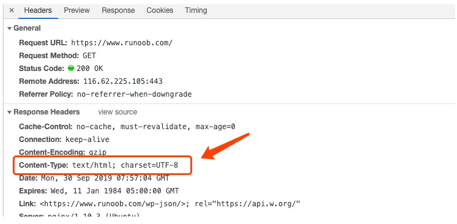

> 本文由 [简悦 SimpRead](http://ksria.com/simpread/) 转码， 原文地址 [itsoku.com](http://itsoku.com/course/6/199)


目录
--

1. 前言
-----

现在搞前端的不学好 http 有关的知识已经不行啦～笔者也是后知后觉，在搞 node 的时候意识到网络方面的薄弱，开始学起 http 相关知识。这一篇是非常基础的讲解，适合入门人员掌握 content-type 的知识和有经验的人员查阅。可以说，弄懂了 content-type，你才能在学习 http 的道路上走的更加顺畅，让我们满怀激情的开始吧～～

2. Http 请求头中的 content-type
--------------------------

### 2.1 认识 content-type

要学习 content-type, 必须事先知道它到底是什么，是干什么用的。

HTTP 协议（RFC2616）采用了请求 / 响应模型。客户端向服务器发送一个请求，请求头包含请求的方法、URI、协议版本、以及包含请求修饰符、客户信息和内容的类似于 MIME 的消息结构。服务器以一个状态行作为响应，相应的内容包括消息协议的版本，成功或者错误编码加上包含服务器信息、实体元信息以 及可能的实体内容。

通常 HTTP 消息由一个起始行，一个或者多个头域，一个只是头域结束的空行和可选的消息体组成。  
HTTP 的头域包括通用头，请求头，响应头和实体头四个部分。每个头域由一个域名，冒号（:）和域值三部分组成。域名是大小写无关的，域值前可以添加任何数量的空格符，头域可以被扩展为多行，在每行开始处，使用至少一个空格或制表符。

请求消息和响应消息都可以包含实体信息，实体信息一般由实体头域和实体组成。实体头域包含关于实体的原信息，实体头包括 Allow、Content- Base、Content-Encoding、Content-Language、 Content-Length、Content-Location、Content-MD5、Content-Range、Content-Type、 Etag、Expires、Last-Modified、extension-header。

Content-Type 是返回消息中非常重要的内容，表示后面的文档属于什么 MIME 类型。Content-Type: [type]/[subtype]; parameter。例如最常见的就是 text/html，它的意思是说返回的内容是文本类型，这个文本又是 HTML 格式的。原则上浏览器会根据 Content-Type 来决定如何显示返回的消息体内容。

### 2.2 Content-type 与 Accept

（1）Accept 属于请求头， Content-Type 属于实体头。

Http 报头分为通用报头，请求报头，响应报头和实体报头。

请求方的 http 报头结构：通用报头 | 请求报头 | 实体报头

响应方的 http 报头结构：通用报头 | 响应报头 | 实体报头

（2）Accept 代表发送端（客户端）希望接受的数据类型。

比如：Accept：text/xml;

代表客户端希望接受的数据类型是 xml 类型

Content-Type 代表发送端（客户端 | 服务器）发送的实体数据的数据类型。

比如：Content-Type：text/html;

代表发送端发送的数据格式是 html。

二者合起来

Accept:text/xml

Content-Type:text/html

即代表希望接受的数据类型是 xml 格式，本次请求发送的数据的数据格式是 html。

### 2.3 content-type 速查

更全面的请访问：`https://www.runoob.com/http/http-content-type.html`

常见的媒体格式类型如下：

```
text/html ： HTML格式
text/plain ：纯文本格式      
text/xml ：  XML格式
image/gif ：gif图片格式    
image/jpeg ：jpg图片格式 
image/png：png图片格式

```

以 application 开头的媒体格式类型：

```
application/xhtml+xml ：XHTML格式
application/xml     ： XML数据格式
application/atom+xml  ：Atom XML聚合格式    
application/json    ： JSON数据格式
application/pdf       ：pdf格式  
application/msword  ： Word文档格式
application/octet-stream ： 二进制流数据（如常见的文件下载）
application/x-www-form-urlencoded ： <form encType=””>中默认的encType，form表单数据被编码为key/value格式发送到服务器（表单默认的提交数据的格式）

```

以 audio 开头的常见媒体格式文件：

```
audio/x-wav : wav文件
audio/x-ms-wma : wma 文件
audio/mp3 : mp3文件

```

以 video 开头的常见媒体格式文件：

```
video/x-ms-wmv : wmv文件
video/mpeg4 : mp4文件
video/avi : avi文件

```

另外一种常见的媒体格式是上传文件之时使用的：

```
multipart/form-data ： 需要在表单中进行文件上传时，就需要使用该格式
```

### 2.4 常见的 content-type 讲解

#### （1）application/x-www-form-urlencoded

这应该是最常见的 POST 提交数据的方式了。浏览器的原生 form 表单，如果不设置 enctype 属性，那么最终就会以 application/x-www-form-urlencoded 方式提交数据。请求类似于下面这样（无关的请求头在本文中都省略掉了）：

```
POST http://www.example.com HTTP/1.1
Content-Type: application/x-www-form-urlencoded;charset=utf-8
title=test&sub%5B%5D=1&sub%5B%5D=2&sub%5B%5D=3

```

首先，Content-Type 被指定为 application/x-www-form-urlencoded；  
其次，**提交的数据按照 key1=val1&key2=val2 的方式进行编码，key 和 val 都进行了 URL 转码。**大部分服务端语言都对这种方式有很好的支持。

很多时候，我们用 Ajax 提交数据时，也是使用这种方式。例如 JQuery 和 QWrap 的 Ajax，Content-Type 默认值都是「application/x-www-form-urlencoded;charset=utf-8」。

#### （2）multipart/form-data

这又是一个常见的 POST 数据提交的方式。我们使用表单上传文件时，必须让 form 的 enctyped 等于这个值。

客户端 form 标签：

```
<form action="url" enctype="multipart/form-data" method="post"></form>
```

直接来看一个生成的请求示例：

```
POST http://www.example.com HTTP/1.1
Content-Type:multipart/form-data; boundary=----WebKitFormBoundaryrGKCBY7qhFd3TrwA
------WebKitFormBoundaryrGKCBY7qhFd3TrwA
Content-Disposition: form-data; 
title
------WebKitFormBoundaryrGKCBY7qhFd3TrwA
Content-Disposition: form-data; 
Content-Type: image/png
PNG ... content of chrome.png ...
------WebKitFormBoundaryrGKCBY7qhFd3TrwA--

```

首先**生成了一个 boundary 用于分割不同的字段**，为了避免与正文内容重复，boundary 很长很复杂。  
然后 Content-Type 里指明了数据是以 mutipart/form-data 来编码，本次请求的 boundary 是什么内容。消息主体里按照字段个数又分为多个结构类似的部分，每部分都是以 –boundary 开始，紧接着内容描述信息，然后是回车，最后是字段具体内容（文本或二进制）。如果传输的是文件，还要包含文件名和文件类型信息。消息主体最后以 –boundary– 标示结束。关于 mutipart/form-data 的详细定义，请前往 rfc1867 查看。

这种方式一般用来上传文件，各大服务端语言对它也有着良好的支持。

上面提到的这两种 POST 数据的方式，都是浏览器原生支持的，而且现阶段原生 form 表单也只支持这两种方式。但是随着越来越多的 Web 站点，尤其是 WebApp，全部使用 Ajax 进行数据交互之后，我们完全可以定义新的数据提交方式，给开发带来更多便利。

#### （3）application/json

application/json 这个 Content-Type 作为响应头大家肯定不陌生。实际上，现在越来越多的人把它作为请求头，用来告诉服务端消息主体是序列化后的 JSON 字符串。由于 JSON 规范的流行，除了低版本 IE 之外的各大浏览器都原生支持 JSON.stringify，服务端语言也都有处理 JSON 的函数，使用 JSON 不会遇上什么麻烦。

JSON 格式支持比键值对复杂得多的结构化数据，这一点也很有用。记得我几年前做一个项目时，需要提交的数据层次非常深，我就是把数据 JSON 序列化之后来提交的。不过当时我是把 JSON 字符串作为 val，仍然放在键值对里，以 x-www-form-urlencoded 方式提交。

Google 的 AngularJS 中的 Ajax 功能，默认就是提交 JSON 字符串。例如下面这段代码：

```
var data = {'title':'test', 'sub' : [1,2,3]};
$http.post(url, data).success(function(result) {
    ...
});

```

最终发送的请求是：

```
POST http://www.example.com HTTP/1.1
Content-Type: application/json;charset=utf-8
{"title":"test","sub":[1,2,3]}

```

这种方案，可以方便的提交复杂的结构化数据，特别适合 RESTful 的接口。各大抓包工具如 Chrome 自带的开发者工具、Firebug、Fiddler，都会以树形结构展示 JSON 数据，非常友好。但也有些服务端语言还没有支持这种方式，例如 php 就无法通过 $_POST 对象从上面的请求中获得内容。这时候，需要自己动手处理下：在请求头中 Content-Type 为 application/json 时，从 php://input 里获得原始输入流，再 json_decode 成对象。一些 php 框架已经开始这么做了。

#### （4）text/xml

它是一种使用 HTTP 作为传输协议，XML 作为编码方式的远程调用规范。典型的 XML-RPC 请求是这样的：

```
POST http://www.example.com HTTP/1.1
Content-Type: text/xml
<?xml version="1.0"?>
<methodCall>
    <methodName>examples.getStateName</methodName>
    <params>
        <param>
            <value><i4>41</i4></value>
        </param>
    </params>
</methodCall>

```

XML-RPC 协议简单、功能够用，各种语言的实现都有。它的使用也很广泛，如 WordPress 的 XML-RPC Api，搜索引擎的 ping 服务等等。JavaScript 中，也有现成的库支持以这种方式进行数据交互，能很好的支持已有的 XML-RPC 服务。不过，我个人觉得 XML 结构还是过于臃肿，一般场景用 JSON 会更灵活方便。

3. HTTP 响应头中的 content-type
--------------------------

Content-Type（内容类型），一般是指网页中存在的 Content-Type，用于定义网络文件的类型和网页的编码，决定浏览器将以什么形式、什么编码读取这个文件，这就是经常看到一些 PHP 网页点击的结果却是下载一个文件或一张图片的原因。

Content-Type 标头告诉客户端实际返回的内容的内容类型。

语法格式：

```
Content-Type: text/html; charset=utf-8
Content-Type: multipart/form-data; boundary=something

```

实例：



常见的媒体格式类型如下：

*   text/html ： HTML 格式
*   text/plain ：纯文本格式
*   text/xml ： XML 格式
*   image/gif ：gif 图片格式
*   image/jpeg ：jpg 图片格式
*   image/png：png 图片格式

以 application 开头的媒体格式类型：

*   application/xhtml+xml ：XHTML 格式
*   application/xml： XML 数据格式
*   application/atom+xml ：Atom XML 聚合格式
*   application/json： JSON 数据格式
*   application/pdf：pdf 格式
*   application/msword ： Word 文档格式
*   application/octet-stream ： 二进制流数据（如常见的文件下载）
*   application/x-www-form-urlencoded ：
    
    中默认的 encType，form 表单数据被编码为 key/value 格式发送到服务器（表单默认的提交数据的格式）
    

另外一种常见的媒体格式是上传文件之时使用的：

*   multipart/form-data ： 需要在表单中进行文件上传时，就需要使用该格式

4. HTTP content-type 对照表
------------------------

<table><thead><tr><th>文件扩展名</th><th>Content-Type(Mime-Type)</th><th>文件扩展名</th><th>Content-Type(Mime-Type)</th></tr></thead><tbody><tr><td>.*（ 二进制流，不知道下载文件类型）</td><td>application/octet-stream</td><td>.tif</td><td>image/tiff</td></tr><tr><td>.001</td><td>application/x-001</td><td>.301</td><td>application/x-301</td></tr><tr><td>.323</td><td>text/h323</td><td>.906</td><td>application/x-906</td></tr><tr><td>.907</td><td>drawing/907</td><td>.a11</td><td>application/x-a11</td></tr><tr><td>.acp</td><td>audio/x-mei-aac</td><td>.ai</td><td>application/postscript</td></tr><tr><td>.aif</td><td>audio/aiff</td><td>.aifc</td><td>audio/aiff</td></tr><tr><td>.aiff</td><td>audio/aiff</td><td>.anv</td><td>application/x-anv</td></tr><tr><td>.asa</td><td>text/asa</td><td>.asf</td><td>video/x-ms-asf</td></tr><tr><td>.asp</td><td>text/asp</td><td>.asx</td><td>video/x-ms-asf</td></tr><tr><td>.au</td><td>audio/basic</td><td>.avi</td><td>video/avi</td></tr><tr><td>.awf</td><td>application/vnd.adobe.workflow</td><td>.biz</td><td>text/xml</td></tr><tr><td>.bmp</td><td>application/x-bmp</td><td>.bot</td><td>application/x-bot</td></tr><tr><td>.c4t</td><td>application/x-c4t</td><td>.c90</td><td>application/x-c90</td></tr><tr><td>.cal</td><td>application/x-cals</td><td>.cat</td><td>application/vnd.ms-pki.seccat</td></tr><tr><td>.cdf</td><td>application/x-netcdf</td><td>.cdr</td><td>application/x-cdr</td></tr><tr><td>.cel</td><td>application/x-cel</td><td>.cer</td><td>application/x-x509-ca-cert</td></tr><tr><td>.cg4</td><td>application/x-g4</td><td>.cgm</td><td>application/x-cgm</td></tr><tr><td>.cit</td><td>application/x-cit</td><td>.class</td><td>java/*</td></tr><tr><td>.cml</td><td>text/xml</td><td>.cmp</td><td>application/x-cmp</td></tr><tr><td>.cmx</td><td>application/x-cmx</td><td>.cot</td><td>application/x-cot</td></tr><tr><td>.crl</td><td>application/pkix-crl</td><td>.crt</td><td>application/x-x509-ca-cert</td></tr><tr><td>.csi</td><td>application/x-csi</td><td>.css</td><td>text/css</td></tr><tr><td>.cut</td><td>application/x-cut</td><td>.dbf</td><td>application/x-dbf</td></tr><tr><td>.dbm</td><td>application/x-dbm</td><td>.dbx</td><td>application/x-dbx</td></tr><tr><td>.dcd</td><td>text/xml</td><td>.dcx</td><td>application/x-dcx</td></tr><tr><td>.der</td><td>application/x-x509-ca-cert</td><td>.dgn</td><td>application/x-dgn</td></tr><tr><td>.dib</td><td>application/x-dib</td><td>.dll</td><td>application/x-msdownload</td></tr><tr><td>.doc</td><td>application/msword</td><td>.dot</td><td>application/msword</td></tr><tr><td>.drw</td><td>application/x-drw</td><td>.dtd</td><td>text/xml</td></tr><tr><td>.dwf</td><td>Model/vnd.dwf</td><td>.dwf</td><td>application/x-dwf</td></tr><tr><td>.dwg</td><td>application/x-dwg</td><td>.dxb</td><td>application/x-dxb</td></tr><tr><td>.dxf</td><td>application/x-dxf</td><td>.edn</td><td>application/vnd.adobe.edn</td></tr><tr><td>.emf</td><td>application/x-emf</td><td>.eml</td><td>message/rfc822</td></tr><tr><td>.ent</td><td>text/xml</td><td>.epi</td><td>application/x-epi</td></tr><tr><td>.eps</td><td>application/x-ps</td><td>.eps</td><td>application/postscript</td></tr><tr><td>.etd</td><td>application/x-ebx</td><td>.exe</td><td>application/x-msdownload</td></tr><tr><td>.fax</td><td>image/fax</td><td>.fdf</td><td>application/vnd.fdf</td></tr><tr><td>.fif</td><td>application/fractals</td><td>.fo</td><td>text/xml</td></tr><tr><td>.frm</td><td>application/x-frm</td><td>.g4</td><td>application/x-g4</td></tr><tr><td>.gbr</td><td>application/x-gbr</td><td>.</td><td>application/x-</td></tr><tr><td>.gif</td><td>image/gif</td><td>.gl2</td><td>application/x-gl2</td></tr><tr><td>.gp4</td><td>application/x-gp4</td><td>.hgl</td><td>application/x-hgl</td></tr><tr><td>.hmr</td><td>application/x-hmr</td><td>.hpg</td><td>application/x-hpgl</td></tr><tr><td>.hpl</td><td>application/x-hpl</td><td>.hqx</td><td>application/mac-binhex40</td></tr><tr><td>.hrf</td><td>application/x-hrf</td><td>.hta</td><td>application/hta</td></tr><tr><td>.htc</td><td>text/x-component</td><td>.htm</td><td>text/html</td></tr><tr><td>.html</td><td>text/html</td><td>.htt</td><td>text/webviewhtml</td></tr><tr><td>.htx</td><td>text/html</td><td>.icb</td><td>application/x-icb</td></tr><tr><td>.ico</td><td>image/x-icon</td><td>.ico</td><td>application/x-ico</td></tr><tr><td>.iff</td><td>application/x-iff</td><td>.ig4</td><td>application/x-g4</td></tr><tr><td>.igs</td><td>application/x-igs</td><td>.iii</td><td>application/x-iphone</td></tr><tr><td>.img</td><td>application/x-img</td><td>.ins</td><td>application/x-internet-signup</td></tr><tr><td>.isp</td><td>application/x-internet-signup</td><td>.IVF</td><td>video/x-ivf</td></tr><tr><td>.java</td><td>java/*</td><td>.jfif</td><td>image/jpeg</td></tr><tr><td>.jpe</td><td>image/jpeg</td><td>.jpe</td><td>application/x-jpe</td></tr><tr><td>.jpeg</td><td>image/jpeg</td><td>.jpg</td><td>image/jpeg</td></tr><tr><td>.jpg</td><td>application/x-jpg</td><td>.js</td><td>application/x-javascript</td></tr><tr><td>.jsp</td><td>text/html</td><td>.la1</td><td>audio/x-liquid-file</td></tr><tr><td>.lar</td><td>application/x-laplayer-reg</td><td>.latex</td><td>application/x-latex</td></tr><tr><td>.lavs</td><td>audio/x-liquid-secure</td><td>.lbm</td><td>application/x-lbm</td></tr><tr><td>.lmsff</td><td>audio/x-la-lms</td><td>.ls</td><td>application/x-javascript</td></tr><tr><td>.ltr</td><td>application/x-ltr</td><td>.m1v</td><td>video/x-mpeg</td></tr><tr><td>.m2v</td><td>video/x-mpeg</td><td>.m3u</td><td>audio/mpegurl</td></tr><tr><td>.m4e</td><td>video/mpeg4</td><td>.mac</td><td>application/x-mac</td></tr><tr><td>.man</td><td>application/x-troff-man</td><td>.math</td><td>text/xml</td></tr><tr><td>.mdb</td><td>application/msaccess</td><td>.mdb</td><td>application/x-mdb</td></tr><tr><td>.mfp</td><td>application/x-shockwave-flash</td><td>.mht</td><td>message/rfc822</td></tr><tr><td>.mhtml</td><td>message/rfc822</td><td>.mi</td><td>application/x-mi</td></tr><tr><td>.mid</td><td>audio/mid</td><td>.midi</td><td>audio/mid</td></tr><tr><td>.mil</td><td>application/x-mil</td><td>.mml</td><td>text/xml</td></tr><tr><td>.mnd</td><td>audio/x-musicnet-download</td><td>.mns</td><td>audio/x-musicnet-stream</td></tr><tr><td>.mocha</td><td>application/x-javascript</td><td>.movie</td><td>video/x-sgi-movie</td></tr><tr><td>.mp1</td><td>audio/mp1</td><td>.mp2</td><td>audio/mp2</td></tr><tr><td>.mp2v</td><td>video/mpeg</td><td>.mp3</td><td>audio/mp3</td></tr><tr><td>.mp4</td><td>video/mpeg4</td><td>.mpa</td><td>video/x-mpg</td></tr><tr><td>.mpd</td><td>application/vnd.ms-project</td><td>.mpe</td><td>video/x-mpeg</td></tr><tr><td>.mpeg</td><td>video/mpg</td><td>.mpg</td><td>video/mpg</td></tr><tr><td>.mpga</td><td>audio/rn-mpeg</td><td>.mpp</td><td>application/vnd.ms-project</td></tr><tr><td>.mps</td><td>video/x-mpeg</td><td>.mpt</td><td>application/vnd.ms-project</td></tr><tr><td>.mpv</td><td>video/mpg</td><td>.mpv2</td><td>video/mpeg</td></tr><tr><td>.mpw</td><td>application/vnd.ms-project</td><td>.mpx</td><td>application/vnd.ms-project</td></tr><tr><td>.mtx</td><td>text/xml</td><td>.mxp</td><td>application/x-mmxp</td></tr><tr><td>.net</td><td>image/pnetvue</td><td>.nrf</td><td>application/x-nrf</td></tr><tr><td>.nws</td><td>message/rfc822</td><td>.odc</td><td>text/x-ms-odc</td></tr><tr><td>.out</td><td>application/x-out</td><td>.p10</td><td>application/pkcs10</td></tr><tr><td>.p12</td><td>application/x-pkcs12</td><td>.p7b</td><td>application/x-pkcs7-certificates</td></tr><tr><td>.p7c</td><td>application/pkcs7-mime</td><td>.p7m</td><td>application/pkcs7-mime</td></tr><tr><td>.p7r</td><td>application/x-pkcs7-certreqresp</td><td>.p7s</td><td>application/pkcs7-signature</td></tr><tr><td>.pc5</td><td>application/x-pc5</td><td>.pci</td><td>application/x-pci</td></tr><tr><td>.pcl</td><td>application/x-pcl</td><td>.pcx</td><td>application/x-pcx</td></tr><tr><td>.pdf</td><td>application/pdf</td><td>.pdf</td><td>application/pdf</td></tr><tr><td>.pdx</td><td>application/vnd.adobe.pdx</td><td>.pfx</td><td>application/x-pkcs12</td></tr><tr><td>.pgl</td><td>application/x-pgl</td><td>.pic</td><td>application/x-pic</td></tr><tr><td>.pko</td><td>application/vnd.ms-pki.pko</td><td>.pl</td><td>application/x-perl</td></tr><tr><td>.plg</td><td>text/html</td><td>.pls</td><td>audio/scpls</td></tr><tr><td>.plt</td><td>application/x-plt</td><td>.png</td><td>image/png</td></tr><tr><td>.png</td><td>application/x-png</td><td>.pot</td><td>application/vnd.ms-powerpoint</td></tr><tr><td>.ppa</td><td>application/vnd.ms-powerpoint</td><td>.ppm</td><td>application/x-ppm</td></tr><tr><td>.pps</td><td>application/vnd.ms-powerpoint</td><td>.ppt</td><td>application/vnd.ms-powerpoint</td></tr><tr><td>.ppt</td><td>application/x-ppt</td><td>.pr</td><td>application/x-pr</td></tr><tr><td>.prf</td><td>application/pics-rules</td><td>.prn</td><td>application/x-prn</td></tr><tr><td>.prt</td><td>application/x-prt</td><td>.ps</td><td>application/x-ps</td></tr><tr><td>.ps</td><td>application/postscript</td><td>.ptn</td><td>application/x-ptn</td></tr><tr><td>.pwz</td><td>application/vnd.ms-powerpoint</td><td>.r3t</td><td>text/vnd.rn-realtext3d</td></tr><tr><td>.ra</td><td>audio/vnd.rn-realaudio</td><td>.ram</td><td>audio/x-pn-realaudio</td></tr><tr><td>.ras</td><td>application/x-ras</td><td>.rat</td><td>application/rat-file</td></tr><tr><td>.rdf</td><td>text/xml</td><td>.rec</td><td>application/vnd.rn-recording</td></tr><tr><td>.red</td><td>application/x-red</td><td>.rgb</td><td>application/x-rgb</td></tr><tr><td>.rjs</td><td>application/vnd.rn-realsystem-rjs</td><td>.rjt</td><td>application/vnd.rn-realsystem-rjt</td></tr><tr><td>.rlc</td><td>application/x-rlc</td><td>.rle</td><td>application/x-rle</td></tr><tr><td>.rm</td><td>application/vnd.rn-realmedia</td><td>.rmf</td><td>application/vnd.adobe.rmf</td></tr><tr><td>.rmi</td><td>audio/mid</td><td>.rmj</td><td>application/vnd.rn-realsystem-rmj</td></tr><tr><td>.rmm</td><td>audio/x-pn-realaudio</td><td>.rmp</td><td>application/vnd.rn-rn_music_package</td></tr><tr><td>.rms</td><td>application/vnd.rn-realmedia-secure</td><td>.rmvb</td><td>application/vnd.rn-realmedia-vbr</td></tr><tr><td>.rmx</td><td>application/vnd.rn-realsystem-rmx</td><td>.rnx</td><td>application/vnd.rn-realplayer</td></tr><tr><td>.rp</td><td>image/vnd.rn-realpix</td><td>.rpm</td><td>audio/x-pn-realaudio-plugin</td></tr><tr><td>.rsml</td><td>application/vnd.rn-rsml</td><td>.rt</td><td>text/vnd.rn-realtext</td></tr><tr><td>.rtf</td><td>application/msword</td><td>.rtf</td><td>application/x-rtf</td></tr><tr><td>.rv</td><td>video/vnd.rn-realvideo</td><td>.sam</td><td>application/x-sam</td></tr><tr><td>.sat</td><td>application/x-sat</td><td>.sdp</td><td>application/sdp</td></tr><tr><td>.sdw</td><td>application/x-sdw</td><td>.sit</td><td>application/x-stuffit</td></tr><tr><td>.slb</td><td>application/x-slb</td><td>.sld</td><td>application/x-sld</td></tr><tr><td>.slk</td><td>drawing/x-slk</td><td>.smi</td><td>application/smil</td></tr><tr><td>.smil</td><td>application/smil</td><td>.smk</td><td>application/x-smk</td></tr><tr><td>.snd</td><td>audio/basic</td><td>.sol</td><td>text/plain</td></tr><tr><td>.sor</td><td>text/plain</td><td>.spc</td><td>application/x-pkcs7-certificates</td></tr><tr><td>.spl</td><td>application/futuresplash</td><td>.spp</td><td>text/xml</td></tr><tr><td>.ssm</td><td>application/streamingmedia</td><td>.sst</td><td>application/vnd.ms-pki.certstore</td></tr><tr><td>.stl</td><td>application/vnd.ms-pki.stl</td><td>.stm</td><td>text/html</td></tr><tr><td>.sty</td><td>application/x-sty</td><td>.svg</td><td>text/xml</td></tr><tr><td>.swf</td><td>application/x-shockwave-flash</td><td>.tdf</td><td>application/x-tdf</td></tr><tr><td>.tg4</td><td>application/x-tg4</td><td>.tga</td><td>application/x-tga</td></tr><tr><td>.tif</td><td>image/tiff</td><td>.tif</td><td>application/x-tif</td></tr><tr><td>.tiff</td><td>image/tiff</td><td>.tld</td><td>text/xml</td></tr><tr><td>.top</td><td>drawing/x-top</td><td>.torrent</td><td>application/x-bittorrent</td></tr><tr><td>.tsd</td><td>text/xml</td><td>.txt</td><td>text/plain</td></tr><tr><td>.uin</td><td>application/x-icq</td><td>.uls</td><td>text/iuls</td></tr><tr><td>.vcf</td><td>text/x-vcard</td><td>.vda</td><td>application/x-vda</td></tr><tr><td>.vdx</td><td>application/vnd.visio</td><td>.vml</td><td>text/xml</td></tr><tr><td>.vpg</td><td>application/x-vpeg005</td><td>.vsd</td><td>application/vnd.visio</td></tr><tr><td>.vsd</td><td>application/x-vsd</td><td>.vss</td><td>application/vnd.visio</td></tr><tr><td>.vst</td><td>application/vnd.visio</td><td>.vst</td><td>application/x-vst</td></tr><tr><td>.vsw</td><td>application/vnd.visio</td><td>.vsx</td><td>application/vnd.visio</td></tr><tr><td>.vtx</td><td>application/vnd.visio</td><td>.vxml</td><td>text/xml</td></tr><tr><td>.wav</td><td>audio/wav</td><td>.wax</td><td>audio/x-ms-wax</td></tr><tr><td>.wb1</td><td>application/x-wb1</td><td>.wb2</td><td>application/x-wb2</td></tr><tr><td>.wb3</td><td>application/x-wb3</td><td>.wbmp</td><td>image/vnd.wap.wbmp</td></tr><tr><td>.wiz</td><td>application/msword</td><td>.wk3</td><td>application/x-wk3</td></tr><tr><td>.wk4</td><td>application/x-wk4</td><td>.wkq</td><td>application/x-wkq</td></tr><tr><td>.wks</td><td>application/x-wks</td><td>.wm</td><td>video/x-ms-wm</td></tr><tr><td>.wma</td><td>audio/x-ms-wma</td><td>.wmd</td><td>application/x-ms-wmd</td></tr><tr><td>.wmf</td><td>application/x-wmf</td><td>.wml</td><td>text/vnd.wap.wml</td></tr><tr><td>.wmv</td><td>video/x-ms-wmv</td><td>.wmx</td><td>video/x-ms-wmx</td></tr><tr><td>.wmz</td><td>application/x-ms-wmz</td><td>.wp6</td><td>application/x-wp6</td></tr><tr><td>.wpd</td><td>application/x-wpd</td><td>.wpg</td><td>application/x-wpg</td></tr><tr><td>.wpl</td><td>application/vnd.ms-wpl</td><td>.wq1</td><td>application/x-wq1</td></tr><tr><td>.wr1</td><td>application/x-wr1</td><td>.wri</td><td>application/x-wri</td></tr><tr><td>.wrk</td><td>application/x-wrk</td><td>.ws</td><td>application/x-ws</td></tr><tr><td>.ws2</td><td>application/x-ws</td><td>.wsc</td><td>text/scriptlet</td></tr><tr><td>.wsdl</td><td>text/xml</td><td>.wvx</td><td>video/x-ms-wvx</td></tr><tr><td>.xdp</td><td>application/vnd.adobe.xdp</td><td>.xdr</td><td>text/xml</td></tr><tr><td>.xfd</td><td>application/vnd.adobe.xfd</td><td>.xfdf</td><td>application/vnd.adobe.xfdf</td></tr><tr><td>.xhtml</td><td>text/html</td><td>.xls</td><td>application/vnd.ms-excel</td></tr><tr><td>.xls</td><td>application/x-xls</td><td>.xlw</td><td>application/x-xlw</td></tr><tr><td>.xml</td><td>text/xml</td><td>.xpl</td><td>audio/scpls</td></tr><tr><td>.xq</td><td>text/xml</td><td>.xql</td><td>text/xml</td></tr><tr><td>.xquery</td><td>text/xml</td><td>.xsd</td><td>text/xml</td></tr><tr><td>.xsl</td><td>text/xml</td><td>.xslt</td><td>text/xml</td></tr><tr><td>.xwd</td><td>application/x-xwd</td><td>.x_b</td><td>application/x-x_b</td></tr><tr><td>.sis</td><td>application/vnd.symbian.install</td><td>.sisx</td><td>application/vnd.symbian.install</td></tr><tr><td>.x_t</td><td>application/x-x_t</td><td>.ipa</td><td>application/vnd.iphone</td></tr><tr><td>.apk</td><td>application/vnd.android.package-archive</td><td>.xap</td><td>application/x-silverlight-app</td></tr></tbody></table>

