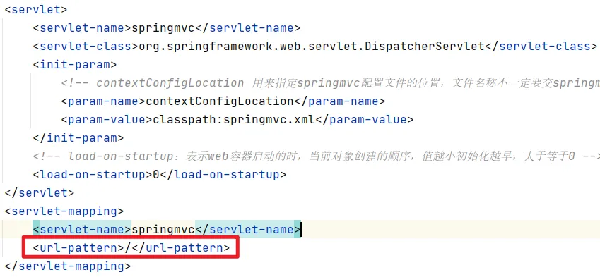
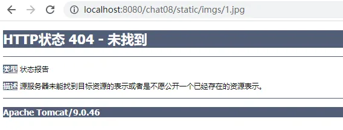

# SpringMVC第11篇：SpringMVC 集成静态资源的多种方式 

## 1、本文内容

- 静态资源 & jsp 是被谁处理的?
- 如何让 springmvc 处理所有请求？
- springmvc 如何处理静态资源？
- springmvc 处理静态资源的 2 种方案、区别、原理详解

## 2、静态资源 & jsp 是被谁处理的?

不知大家是否注意了一个问题，我们将 web 项目发布到 tomcat 后，可以直接访问 jsp 后缀的文件，或者直接访问项目中的静态资源（js/css/图片之类的文件），只要路径写的没有问题，都可以正常在浏览器中显示，大家是否思考过，是谁在处理这个请求呢？

tomcat 是一个 servlet 容器，servlet 容器中通常有 servlet 来处理各种请求，那么当我们访问静态资源或者 jsp 的时候，当然也是由 servlet 来处理这些请求的，但是我们并没有在 web.xml 中配置由哪个 servlet 来处理这些请求啊，这是因为 tomcat 中自动帮我们配置了一些默认的 servlet 来处理这类的请求。

tomcat 的安装目录中有个 web.xml 文件，位于（apache-tomcat-9.0.46\conf\web.xml），这个文件相当于对发布到 tomcat 中的所有 web 项目的默认配置，我们来看一下这个文件，有几个重要的 servlet 配置信息，这些 servlet 可以用来处理 jsp 后置的文件或者静态资源，抽取部分配置如下：

```xml
<!--默认的servlet-->
<servlet>
    <servlet-name>default</servlet-name>
    <servlet-class>org.apache.catalina.servlets.DefaultServlet</servlet-class>
    <load-on-startup>1</load-on-startup>
</servlet>

<!--处理jsp文件的Servlet-->
<servlet>
    <servlet-name>jsp</servlet-name>
 	<servlet-class>org.apache.jasper.servlet.JspServlet</servlet-class>
    <load-on-startup>3</load-on-startup>
</servlet>

<servlet-mapping>
    <servlet-name>default</servlet-name>
    <url-pattern>/</url-pattern>
</servlet-mapping>

<servlet-mapping>
 <servlet-name>jsp</servlet-name>
 <url-pattern>*.jsp</url-pattern>
 <url-pattern>*.jspx</url-pattern>
</servlet-mapping>
```

> 配置中主要定义了 2 个 servlet
>
> 1. JspServlet 用来处理 jsp 文件
> 2. DefaultServlet 会处理 / 开头的请求，这里重点说下这个 servlet 的处理逻辑，它会处理所有其他 servlet 不匹配的请求，当一个请求过来之后，会先去匹配其他的 servlet，当找不到匹配的 servlet 的时候，才会走 DefaultServlet
> 3. 我们可以在项目中的 web.xml 中对 tomcat/config/web.xml 中的配置进行覆盖，即项目中的 web.xml 相对于 tomcat 中的 web.xml 有更高的优先级。

## 3、如何让 springmvc 处理所有请求？

如果我们想让 springmvc 来处理所有的请求，怎么做呢？只需修改 web.xml 中的配置，将 springmvc 这个 servlet 的 url-pattern 的值设置为`/`就可以了，此时所有的请求都会被 springmvc 处理，即所有的请求都会被 `DispatcherServlet` 处理。




## 4、问题来了：静态资源 404 了

当我们将上面 springmvc 的 url-pattern 改为 / 时，大家可以自己去试试，此时再访问静态资源的时候，如下图，会报 404，这个请求被 DispatcherServlet 接收了，但是这个 servlet 默认情况下并没有处理静态资源的能力，即找不到请求的资源，所以才会报 404



springmvc 提供了 2 种解决方案，来看下。

## 5、方案 1：使用

在 springmvc 的配置文件中添加下面配置：

```xml
<mvc:annotation-driven/>
<mvc:default-servlet-handler/>
```

> 这里说一下原理
>
> 1、加入配置后，Spring 框架会创建 `DefaultServletHttpRequestHandler` 对象，这个对象会将请转发给 tomcat 的 default 这个 servlet 处理，所以静态资源就可以正常访问了
>
> 2、注意：配置中的第 1 行 `<mvc:annotation-driven/>` 也必须加上，如果不加上，@RequestMapping 的请求就无法处理了
>
> 3、这种用法有个前提是，web 容器中需要有 default 这个 servlet，且这个 servlet 可以处理静态资源

## 6、方案 2：使用

从 spring3.0 版本后，spring 定义了专门处理静态资源访问请求的处理器 `ResourceHttpRequestHandler` ，并且添加了标签，用来处理静态资源无法访问的问题。

需要在 springmvc 配置文件中添加如下配置：

```xml
<mvc:annotation-driven/>
<mvc:resources mapping="/imgs/**" location="/static/imgs/"/>
<mvc:resources mapping="/css/**" location="/static/css/"/>
<mvc:resources mapping="/js/**" location="/static/js/"/>
```

> - mvc:resource 标签用来指定请求的静态资源的 url 和本地地址的映射关系
> - mapping：用来指定请求的地址的，比如/imgs/**：可以匹配任何以 imgs 开头的 url，如：/imgs/1.jpg、/imgs/2.jpg、/imgs/order/3.jpg
> - location：用来指定静态资源所在项目中的目录
> - 注意：配置中的第 1 行``也必须加上，如果不加上，@RequestMapping 的请求就无法处理了
> - 这种用法不依赖于 web 容器，所以比第一种方案要好一些，也建议大家用这种方案。

上面代码中配置了 3 行 mvc:resources，可以优化下，如下

```xml
<mvc:annotation-driven/>
<mvc:resources mapping="/static/**" location="/static/"/>
```

## 7、总结

- tomcat 默认能够处理 jsp 和静态资源，是因为 tomcat 中默认有 2 个 servlet：default 和 jsp
- 到此我们已经知道如何让 springmvc 来处理所有请求了，只需要在 web.xml 中调整一下 url-pattern 的值为/就可以了
- 默认情况下，springmvc 无法处理静态资源，本文介绍了 2 种方式，大家可以回头在再去看看，第一种需要依赖于 web 容器中的 default 这个 servlet，使用上面对 web 容器有依赖作用；而第 2 种方式是 springmvc 推荐的方式，更好一些，对 web 容器没有依赖
- 不管用那种方式，都不要忘记了`<mvc:annotation-driven/>` 这个配置，否则咱们自定义的 controller 中的@RequestMapping 就无效了

