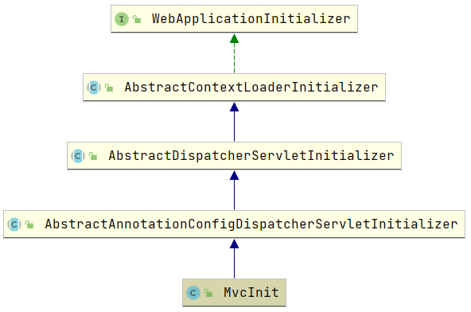
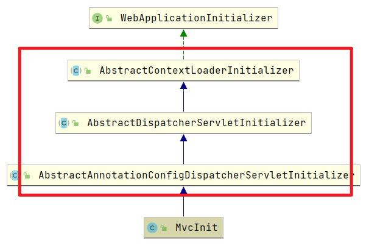
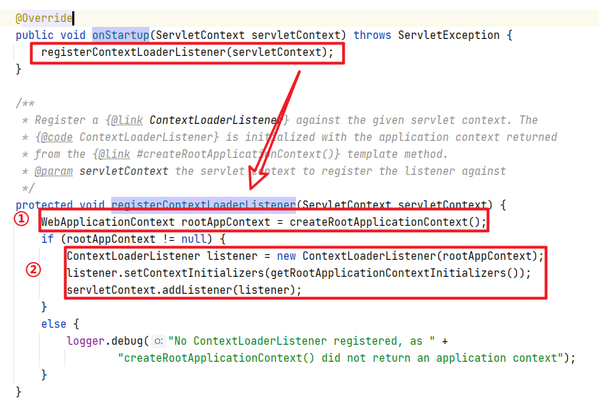
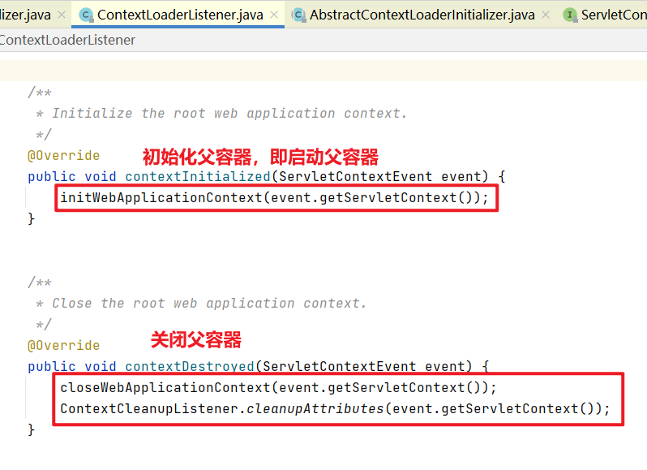
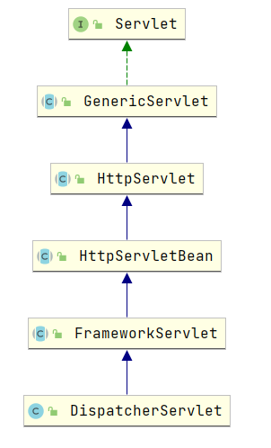
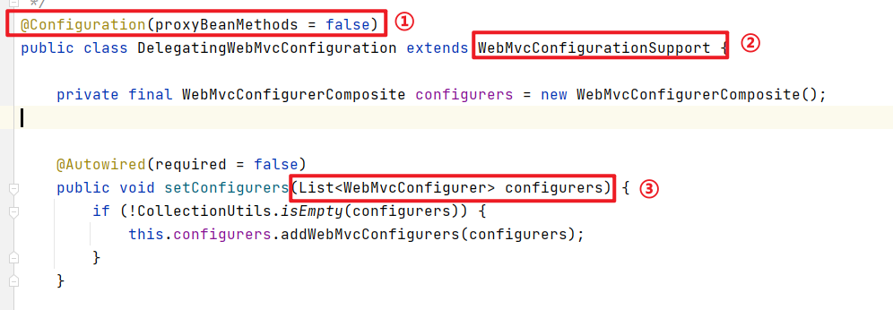
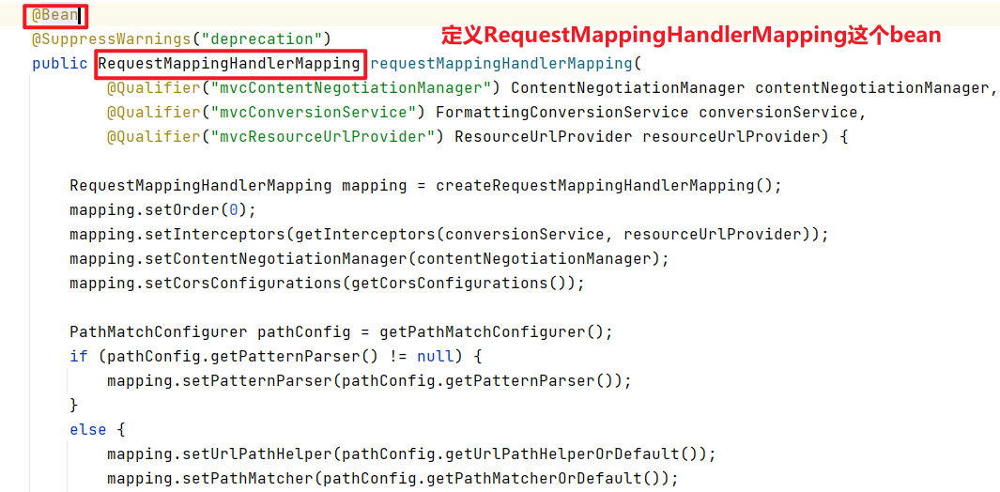
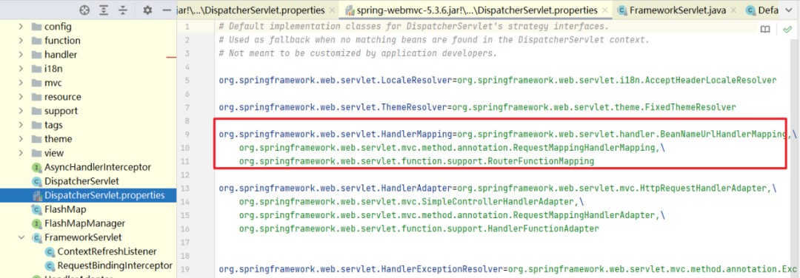
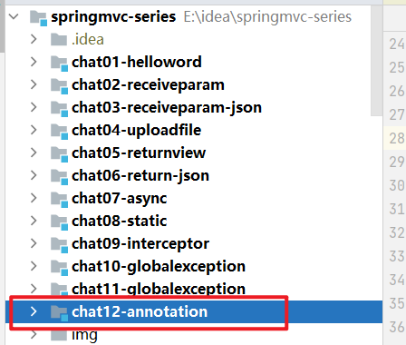

本文将通过阅读源码的方式带大家了解 springmv 容器启动的过程，SpringMVC 中的各种组件都是在容器启动的过程中组装的，所以如果熟悉整个过程后，你可以随意对 SpringMVC 进行扩展，SpringMVC 会被你玩的出神入化。

## 1、前言

SpringMVC，建议大家使用全注解的方式，全注解的方式及原理不了解的，先去看一下这篇文章：[SpringMVC 全注解方式如何使用？](https://mp.weixin.qq.com/s?__biz=MzA5MTkxMDQ4MQ==&mid=2648941234&idx=1&sn=7544eb293fd1edbbf8c6c6ba9d828cdb&scene=21#wechat_redirect)

上面的文章看懂以后再来看本文，否则将出现消化不良的现象。

本文以全注解的方式为基础，来解说 SpringMVC 容器启动的整个流程。

## 2、回顾全注解方式 2 个关键类

全注解的方式重点就在于 2 个类：MVC 初始化类、MVC 配置类

### 2.1、MVC 初始化类

代码如下，这个类需要继承 AbstractAnnotationConfigDispatcherServletInitializer，会有 web 容器来调用，这个类中有 4 个方法需要实现，干了 4 件事情

- getRootConfigClasses()：获取父容器的配置类
- getServletConfigClasses()：获取 springmvc 容器的配置类，这个配置类相当于 springmvc xml 配置文件的功能
- getServletMappings()：获取 DispatcherServlet 能够处理的 url，相当于 web.xml 中为 servlet 指定的 url-pattern
- getServletFilters()：定义所有的 Filter

```
/**
 * ①：1、创建Mvc初始化类，需要继承AbstractAnnotationConfigDispatcherServletInitializer类
 */
public class MvcInit extends AbstractAnnotationConfigDispatcherServletInitializer {
    /**
     * springmvc容器的父容器spring配置类
     * 实际工作中我们的项目比较复杂，可以将controller层放在springmvc容器中
     * 其他层，如service层、dao层放在父容器了，bean管理起来更清晰一些
     * 也可以没有父容器，将所有bean都放在springmvc容器中
     *
     * @return
     */
    @Override
    protected Class<?>[] getRootConfigClasses() {
        return new Class[0];
    }

    /**
     * ②：2、设置springmvc容器的spring配置类
     *
     * @return
     */
    @Override
    protected Class<?>[] getServletConfigClasses() {
        return new Class[]{MvcConfig.class};
    }

    /**
     * ③：3、配置DispatcherServlet的url-pattern
     *
     * @return
     */
    @Override
    protected String[] getServletMappings() {
        return new String[]{"/"};
    }

    /**
     * ④：4、注册拦截器
     *
     * @return
     */
    @Override
    protected Filter[] getServletFilters() {
        //添加拦截器，解决乱码问题
        CharacterEncodingFilter characterEncodingFilter = new CharacterEncodingFilter();
        characterEncodingFilter.setEncoding("UTF-8");
        characterEncodingFilter.setForceRequestEncoding(true);
        characterEncodingFilter.setForceResponseEncoding(true);
        return new Filter[]{characterEncodingFilter};
    }
}
```

### 2.2、MVC 配置类

代码如下，这个配置类相当于 springmvc xml 配置文件的功能，可以在里面定义 springmvc 各种组件

```
/**
 * 1.开启springmvc注解配置
 * 2、配置视图解析器
 * 3、配置截器
 * 4、配置静态资源访问
 * 5、配置文件上传解析器
 * 6、配置全局异常处理器
 */
@Configuration
@ComponentScan("com.javacode2018.springmvc.chat12")
@EnableWebMvc //1：使用EnableWebMvc开启springmvc注解方式配置
public class MvcConfig implements WebMvcConfigurer {

    /**
     * 2、添加视图解析器（可以添加多个）
     *
     * @param registry
     */
    @Override
    public void configureViewResolvers(ViewResolverRegistry registry) {
        InternalResourceViewResolver resolver = new InternalResourceViewResolver();
        resolver.setPrefix("/WEB-INF/view/");
        resolver.setSuffix(".jsp");
        resolver.setOrder(Ordered.LOWEST_PRECEDENCE);
        registry.viewResolver(resolver);
    }

    @Autowired
    private MyInterceptor myInterceptor;

    /**
     * 3、添加拦截器（可以添加多个）
     *
     * @param registry
     */
    @Override
    public void addInterceptors(InterceptorRegistry registry) {
        registry.addInterceptor(this.myInterceptor).addPathPatterns("/**");
    }


    /**
     * 4、配置静态资源访问处理器
     *
     * @param registry
     */
    @Override
    public void addResourceHandlers(ResourceHandlerRegistry registry) {
        registry.addResourceHandler("/static/**").addResourceLocations("/static/");
    }

    /**
     * 5、配置文件上传解析器
     *
     * @return
     */
    @Bean
    public CommonsMultipartResolver multipartResolver() {
        CommonsMultipartResolver commonsMultipartResolver = new CommonsMultipartResolver();
        //maxUploadSizePerFile:单个文件大小限制（byte）
        //maxUploadSize：整个请求大小限制（byte）
        commonsMultipartResolver.setMaxUploadSizePerFile(10 * 1024 * 1024);
        commonsMultipartResolver.setMaxUploadSize(100 * 1024 * 1024);
        return commonsMultipartResolver;
    }
}
```

## 2、SpringMVC 容器的生命周期 (9 个阶段)

1. 阶段 1：Servlet 容器初始化
2. 阶段 2：创建父容器
3. 阶段 3：创建 springmvc 容器
4. 阶段 4：Servlet 容器中注册 DispatcherServlet
5. 阶段 5：启动父容器：ContextLoaderListener
6. 阶段 6：启动 springmvc 容器：DispatcherServlet#init()
7. 阶段 7：springmvc 容器启动过程中处理 @WebMVC
8. 阶段 8：组装 DispatcherServlet 中各种 SpringMVC 需要的组件
9. 阶段 9：销毁 2 个容器

## 3、阶段 1：Servlet 容器初始化

### 3.1、ServletContainerInitializer

咱们知道 servlet3.0 中新增了一个接口：`ServletContainerInitializer`，这个接口功能特别的牛逼，有了它之后，web.xml 配置文件可要可不要了。

```
public interface ServletContainerInitializer {
    public void onStartup(Set<Class<?>> c, ServletContext ctx)
        throws ServletException;
}
```

这个接口的实现类，如果满足下面 2 个条件，Servlet 容器启动的过程中会自动实例化这些类，然后调用他们的 onStartUp 方法，然后我们就可以在这些类的 onStartUp 方法中干活了，在 web.xml 干的所有事情，都可以在这个方法中干，特别强大：

这个类必须实现 ServletContainerInitializer 接口，且非抽象类这个类的全类名必须要放在`META-INF/services/javax.servlet.ServletContainerInitializer`这个文件中

### 3.2、SpringServletContainerInitializer

下面重点来了，springmvc 提供了一个类`SpringServletContainerInitializer`，满足了上面个条件。


spring-web-5.3.6.jar!\META-INF\services\javax.servlet.ServletContainerInitializer


所以 SpringServletContainerInitializer 的 onStart 方法会 servlet 容器自动被调用

### 3.3、SpringServletContainerInitializer#onStartup 方法

这个类的源码，大家先看一下，这个类干的事情：

类上有 @HandlesTypes(WebApplicationInitializer.class) 这个注解，注解的值为`WebApplicationInitializer.class`，所以 onStartup 方法的第一个参数是`WebApplicationInitializer`类型的集合，这个集合由 web 容器自动扫描获取，然后传入进来实例化 WebApplicationInitializer 集合对 WebApplicationInitializer 集合进行排序循环调用 WebApplicationInitializer 的 onStartup 方法

```
@HandlesTypes(WebApplicationInitializer.class) //@1
public class SpringServletContainerInitializer implements ServletContainerInitializer {

 @Override
 public void onStartup(@Nullable Set<Class<?>> webAppInitializerClasses, ServletContext servletContext)
   throws ServletException {

  List<WebApplicationInitializer> initializers = Collections.emptyList();

  if (webAppInitializerClasses != null) {
   initializers = new ArrayList<>(webAppInitializerClasses.size());
   for (Class<?> waiClass : webAppInitializerClasses) {
    // Be defensive: Some servlet containers provide us with invalid classes,
    // no matter what @HandlesTypes says...
    if (!waiClass.isInterface() && !Modifier.isAbstract(waiClass.getModifiers()) &&
      WebApplicationInitializer.class.isAssignableFrom(waiClass)) {
     try {
      initializers.add((WebApplicationInitializer)
        ReflectionUtils.accessibleConstructor(waiClass).newInstance());
     }
     catch (Throwable ex) {
      throw new ServletException("Failed to instantiate WebApplicationInitializer class", ex);
     }
    }
   }
  }

  if (initializers.isEmpty()) {
   servletContext.log("No Spring WebApplicationInitializer types detected on classpath");
   return;
  }

  servletContext.log(initializers.size() + " Spring WebApplicationInitializers detected on classpath");
  AnnotationAwareOrderComparator.sort(initializers);
  for (WebApplicationInitializer initializer : initializers) {
   initializer.onStartup(servletContext);
  }
 }

}
```

下面重点要看`WebApplicationInitializer`接口了。

### 3.4、WebApplicationInitializer：web 应用初始化

接口比较简单，就一个方法，参数是 servlet 上下文对象，有了个对象，可以干 web.xml 中的一切事情了，比如注册 servlet、filter、监听器等等

```
public interface WebApplicationInitializer {

 void onStartup(ServletContext servletContext) throws ServletException;

}
```

如下图，看一下类的继承关系，咱们的 MvcInit 就实现了这个接口，所以 MvcInit 的 onStartup 方法会被调费用





关键代码在这 3 个类中





### 3.5、进入 AbstractDispatcherServletInitializer#onStartup 方法

```
public void onStartup(ServletContext servletContext) throws ServletException {
    super.onStartup(servletContext);
    registerDispatcherServlet(servletContext);
}
```

**这里是重点：这个方法中干了 4 件事情**

创建父容器，只是实例化了，并未启动创建了监听器 ContextLoaderListener，这是一个 ServletContextListener 类型的监听器，稍后会在这个监听器中启动父容器创建 springmvc 容器，只是实例化了，并未启动，启动的事情会在 DispatcherServlet#init 中做，稍后会说Servlet 容器中注册 DispatcherServlet

下面，咱们来详细看这几个步骤，把这几个步骤作为阶段来解读。

## 4、阶段 2：创建父容器

父容器可有可无，并不是必须的，为了更好的管理 bean，springmvc 建议我们用父子容器，controller 之外的 bean，比如 service，dao 等，建议放到父容器中，controller 层的和 springmvc 相关的一些 bean 放在 springmvc 容器中，咱们继续。

### 4.1、过程

`AbstractDispatcherServletInitializer#onStartup`方法中会调用父类的`onStartup`，即`AbstractContextLoaderInitializer#onStartup`，我们进到这个方法中，代码如下图，干了 2 个事情

图中编号 ①：创建父容器，只是实例化了，并未启动图中编号 ②：创建了一个监听器 ContextLoaderListener，这是一个 ServletContextListener 类型的监听器，稍后会在这个监听器中启动父容器





下面来分别来细说下上面 2 段代码干的活。

### 4.2、①：负责创建父容器

`AbstractAnnotationConfigDispatcherServletInitializer#createRootApplicationContext`，只是创建了一个`AnnotationConfigWebApplicationContext`对象，并将父容器配置类 rootConfigClass 注册到容器中，并没有启动这个容器，若 rootConfigClass 为空，父容器不会被创建，所以父容器可有可无。


### 4.2、②：创建 ContextLoaderListener 监听器

代码如下，创建的时候将父容器对象 rootAContext 传进去了。

```
ContextLoaderListener listener = new ContextLoaderListener(rootAppContext);
//getRootApplicationContextInitializers()返回置为ApplicationContextInitializer数组，是个函数式接口，在父容器初始化的过程中，会作为一个扩展点预留给开发者用
listener.setContextInitializers(getRootApplicationContextInitializers());
servletContext.addListener(listener);
```

ContextLoaderListener，这是一个 ServletContextListener 类型的监听器，所以在 web 容器启动和销毁的过程中会被调用，如下图，这个监听器干了 2 件事

contextInitialized 方法：这个方法会在 web 容器启动时被调用，内部负责启动父容器在 contextDestroyed 方法：这个方法会在 web 容器销毁时被调用，内部负责关闭父容器





## 5、阶段 3&4：创建 springmvc 容器 & 注册 DispatcherServlet

在回到`AbstractDispatcherServletInitializer#onStartup`，看这个方法的第二行，如下图


`registerDispatcherServlet`源码如下

```
protected void registerDispatcherServlet(ServletContext servletContext) {
    //①：DispatcherServlet的servlet名称，默认为：dispatcher
    String servletName = getServletName();

    //②：创建springmvc容器
    WebApplicationContext servletAppContext = createServletApplicationContext();

    //③：创建DispatcherServlet,注意这里将springmvc容器对象做为参数传递给DispatcherServlet了
    FrameworkServlet dispatcherServlet = createDispatcherServlet(servletAppContext);
    //设置ApplicationContextInitializer列表，可以对springmvc容器在启动之前进行定制化
    dispatcherServlet.setContextInitializers(getServletApplicationContextInitializers());

    //④：将 dispatcherServlet 注册到servlet上下文中
    ServletRegistration.Dynamic registration = servletContext.addServlet(servletName, dispatcherServlet);
    registration.setLoadOnStartup(1);
    registration.addMapping(getServletMappings());
    registration.setAsyncSupported(isAsyncSupported());

    //⑤：注册Filter
    Filter[] filters = getServletFilters();
    if (!ObjectUtils.isEmpty(filters)) {
        for (Filter filter : filters) {
            registerServletFilter(servletContext, filter);
        }
    }
    //⑥：这个方法预留给咱们自己去实现，可以对dispatcherServlet做一些特殊的配置
    customizeRegistration(registration);
}

protected FrameworkServlet createDispatcherServlet(WebApplicationContext servletAppContext) {
    return new DispatcherServlet(servletAppContext);
}
```

## 6、阶段 5：启动父容器：ContextLoaderListener

### 6.1、过程

上面的`onStartup`方法执行完毕之后，会执行监听器`ContextLoaderListener`的初始化，会进入到他的`contextInitialized`方法中


`initWebApplicationContext`源码如下，截取了主要的几行

```
public WebApplicationContext initWebApplicationContext(ServletContext servletContext) {
    //this.context就是父容器对象
    ConfigurableWebApplicationContext cwac = (ConfigurableWebApplicationContext) this.context;
    //①：配置及启动父容器
    configureAndRefreshWebApplicationContext(cwac, servletContext);
    //将父容器丢到servletContext中进行共享，方便其他地方获取
    servletContext.setAttribute(WebApplicationContext.ROOT_WEB_APPLICATION_CONTEXT_ATTRIBUTE, this.context);
}
```

### 6.2、代码 ①：配置父容器以及启动父容器

```
//①：配置及启动父容器
configureAndRefreshWebApplicationContext(cwac, servletContext);
```

`configureAndRefreshWebApplicationContext`方法关键代码如下

```
protected void configureAndRefreshWebApplicationContext(ConfigurableWebApplicationContext wac, ServletContext sc) {
    //①：定制上线文，这里主要是遍历ApplicationContextInitializer列表，调用每个ApplicationContextInitializer#initialize方法来对容器进行定制，相当于一个扩展点，可以有程序员自己控制
    customizeContext(sc, wac);
    //②：刷新容器，就相当于启动容器了，此时就会组装里面的bean了
    wac.refresh();
}
```

`customizeContext`方法，我们进去看一下，这里涉及到了一个新的类，所以有必要去看一下，混个脸熟，源码如下，这是给开发者留的一个扩展点，通过`ApplicationContextInitializer`这个来做扩展，这是一个函数式接口，下面代码会遍历`ApplicationContextInitializer`列表，然后调用其`initialize`方法，我们可以在这个方法中对 spring 上线文进行定制

```
protected void customizeContext(ServletContext sc, ConfigurableWebApplicationContext wac) {
  List<Class<ApplicationContextInitializer<ConfigurableApplicationContext>>> initializerClasses =
    determineContextInitializerClasses(sc);

    for (Class<ApplicationContextInitializer<ConfigurableApplicationContext>> initializerClass : initializerClasses) {
        Class<?> initializerContextClass =
            GenericTypeResolver.resolveTypeArgument(initializerClass, ApplicationContextInitializer.class);
        if (initializerContextClass != null && !initializerContextClass.isInstance(wac)) {
            throw new ApplicationContextException(String.format(
                "Could not apply context initializer [%s] since its generic parameter [%s] " +
                "is not assignable from the type of application context used by this " +
                "context loader: [%s]", initializerClass.getName(), initializerContextClass.getName(),
                wac.getClass().getName()));
        }
        this.contextInitializers.add(BeanUtils.instantiateClass(initializerClass));
    }

    AnnotationAwareOrderComparator.sort(this.contextInitializers);
    for (ApplicationContextInitializer<ConfigurableApplicationContext> initializer : this.contextInitializers) {
        initializer.initialize(wac);
    }
}
```

### 6.3、ApplicationContextInitializer 接口：容器启动前用来初始化容器

是个函数式接口，在容器启动之前用来对容器进行定制，作为一个扩展点预留给开发者用，父容器和 springmvc 容器都用到了。

```
@FunctionalInterface
public interface ApplicationContextInitializer<C extends ConfigurableApplicationContext> {

 /**
  * 初始化给定的spring容器
  * @param applicationContext the application to configure
  */
 void initialize(C applicationContext);

}
```

## 7、阶段 6：启动 springmvc 容器：DispatcherServlet#init()

到目前为止父容器已经启动完毕了，此时 DispatcherServlet 会被初始化，会进入到他的 init() 方法中。

### 7.1、DispatcherServlet 类图





### 7.2、HttpServletBean#init()

这个方法会调用`initServletBean()`这个方法，其他的先不看


### 7.3、FrameworkServlet#initServletBean

提取了关键的代码，就 2 行

```
@Override
protected final void initServletBean() throws ServletException {
    //初始化springmvc容器，就是启动springmvc容器
    this.webApplicationContext = initWebApplicationContext();
    //这个方法内部是空的，预留给子类去实现的，目前没啥用
    initFrameworkServlet();
}
```

下面咱们进到`initWebApplicationContext`方法中去。

### 7.4、FrameworkServlet#initWebApplicationContext

关键代码如下，干了 3 件事情：

1. 从 servlet 上线文对象中找到父容器
2. 为 springmvc 容器指定父容器
3. 调用 configureAndRefreshWebApplicationContext 方法配置 springmvc 容器以及启动容器，这个是关键咯

```
protected WebApplicationContext initWebApplicationContext() {
    //①：从servlet上线文中获取父容器
    WebApplicationContext rootContext =
        WebApplicationContextUtils.getWebApplicationContext(getServletContext());
    WebApplicationContext wac = null;
 //②：this.webApplicationContext就是springmvc容器，此时这个对对象不为null，所以满足条件
    if (this.webApplicationContext != null) {
        wac = this.webApplicationContext;
        if (wac instanceof ConfigurableWebApplicationContext) {
            ConfigurableWebApplicationContext cwac = (ConfigurableWebApplicationContext) wac;
            //springmvc容器未启动
            if (!cwac.isActive()) {
                //springmvc容器未设置父容器，则给其设置父容器，此时rootContext可能为空，这个没什么关系
                if (cwac.getParent() == null) {
                    cwac.setParent(rootContext);
                }
                //③：配置springmvc容器以及启动springmvc容器
                configureAndRefreshWebApplicationContext(cwac);
            }
        }
    }
    //这里省略了一部分代码，如果springmvc采用配置文件的方式会走这部分代码
    ......
 //返回容器
    return wac;
}
```

### 7.5、FrameworkServlet#configureAndRefreshWebApplicationContext

为了让大家看清楚，如下代码，这里只提取了关键代码，主要干了 3 件事情

1. 代码 ①：向 springmvc 容器中添加了一个 ContextRefreshListener 监听器，这个监听器非常非常重要，springmvc 容器启动完毕之后会被调用，**会出现在阶段 8 中**
2. 代码 ②：给开发者预留的一个扩展点，通过 ApplicationContextInitializer#initialize 方法对容器进行定制
3. 代码 ③：启动容器

```
protected void configureAndRefreshWebApplicationContext(ConfigurableWebApplicationContext wac) {
 //①：向springmvc容器中添加了一个监听器对象，这个监听器特别重要，稍后在
    wac.addApplicationListener(new SourceFilteringListener(wac, new ContextRefreshListener()));
 //②：扩展点：循环遍历ApplicationContextInitializer列表，调用其initialize方法对容器进行定制
    applyInitializers(wac);
    //③：刷新容器，相当于启动容器
    wac.refresh();
}
```

## 8、阶段 7：springmvc 容器启动过程中处理 @WebMVC

### 8.1、SpringMVC 配置类被处理

此时 springmvc 容器启动了，此时注意下`MvcConfig`这个类，由于其上有 @Conguration 注解，所以会被当做一个配置类被处理，这个类有 2 个非常重要的特征。

标注了 @EnableWebMvc 注解实现了 WebMvcConfigurer 接口


下面来说说这 2 个特征的作用。

### 8.2、@EnableWebMvc：配置 springmvc 所需组件

看一下这个注解的源码，如下，重点在于它上面的`@Import(DelegatingWebMvcConfiguration.class)`注解，这个注解的功能不知道的，可以回头去看我的 spring 系列，从头看一遍。


### 8.3、进入 DelegatingWebMvcConfiguration 类

代码如下，先注意下面 3 个特征

代码编号 ①：标注有 @Configuration 注解，说明是一个配置类代码编号 ②：继承了 WebMvcConfigurationSupport 类，这个类中有很多 @Bean 标注的方法，用来定义了 springmvc 需要的所有组件代码编号 ③：注入了`WebMvcConfigurer`列表，注意下，我们的 WebConfig 类就实现了 WebMvcConfigurer 这个接口，内部提供了很多方法可以用来对 springmvc 的组件进行自定义配置





先来看看 WebMvcConfigurationSupport 这个类。

### 8.4、WebMvcConfigurationSupport：配置 springmvc 所需所有组件

这个类中会定义 springmvc 需要的所有组件，比如：RequestMapping、HandlerAdapter、HandlerInterceptor、HttpMessageConverter、HandlerMethodArgumentResolver、HandlerMethodReturnValueHandler 等等，所以如果你感觉 @WebMVC 注解满足不了你的需求时，你可以直接继承这个类进行扩展。

这个类的源码我就不贴了，截几个图给大家看看





### 8.5、WebMvcConfigurer 接口

这个接口就是我们用来对 springmvc 容器中的组件进行定制的，WebMvcConfigurationSupport 中创建 springmvc 组件的时候，会自动调用 WebMvcConfigurer 中对应的一些方法，来对组件进行定制，比如可以在 WebMvcConfigurer 中添加拦截器、配置默认 servlet 处理器、静态资源处理器等等，这个接口的源码如下

```
public interface WebMvcConfigurer {

 /**
  * 配置PathMatchConfigurer
  */
 default void configurePathMatch(PathMatchConfigurer configurer) {
 }

 /**
  * 配置ContentNegotiationConfigurer
  */
 default void configureContentNegotiation(ContentNegotiationConfigurer configurer) {
 }

 /**
  * 异步处理配置
  */
 default void configureAsyncSupport(AsyncSupportConfigurer configurer) {
 }

 /**
  * 配置默认servlet处理器
  */
 default void configureDefaultServletHandling(DefaultServletHandlerConfigurer configurer) {
 }

 /**
  * 配置Formatter
  */
 default void addFormatters(FormatterRegistry registry) {
 }

 /**
  * 添加拦截器
  */
 default void addInterceptors(InterceptorRegistry registry) {
 }

 /**
  * 静态资源配置
  */
 default void addResourceHandlers(ResourceHandlerRegistry registry) {
 }

 /**
  * 跨越的配置
  */
 default void addCorsMappings(CorsRegistry registry) {
 }

 /**
  * 配置ViewController
  */
 default void addViewControllers(ViewControllerRegistry registry) {
 }

 /**
  * 注册视图解析器（ViewResolverRegistry）
  */
 default void configureViewResolvers(ViewResolverRegistry registry) {
 }

 /**
  * 注册处理器方法参数解析器（HandlerMethodArgumentResolver）
  */
 default void addArgumentResolvers(List<HandlerMethodArgumentResolver> resolvers) {
 }

 /**
  * 注册处理器方法返回值处理器（HandlerMethodReturnValueHandler）
  */
 default void addReturnValueHandlers(List<HandlerMethodReturnValueHandler> handlers) {
 }

 /**
  * 注册http报文转换器（HttpMessageConverter）
  */
 default void configureMessageConverters(List<HttpMessageConverter<?>> converters) {
 }

 /**
  * 扩展报文转换器
  */
 default void extendMessageConverters(List<HttpMessageConverter<?>> converters) {
 }

 /**
  * 配置异常解析器（HandlerExceptionResolver）
  */
 default void configureHandlerExceptionResolvers(List<HandlerExceptionResolver> resolvers) {
 }

 /**
  * 扩展异常解析器（HandlerExceptionResolver）
  */
 default void extendHandlerExceptionResolvers(List<HandlerExceptionResolver> resolvers) {
 }

 /**
  * 获得验证器
  */
 @Nullable
 default Validator getValidator() {
  return null;
 }

 /**
  * 获得MessageCodesResolver
  */
 @Nullable
 default MessageCodesResolver getMessageCodesResolver() {
  return null;
 }

}
```

## 9、阶段 8：组装 DispatcherServlet 中各种 SpringMVC 需要的组件

### 9.1、触发 ContextRefreshListener 监听器

大家回头看一下 8.5 中，有这样一段代码，注册了一个监听器`ContextRefreshListener`


再来看看这个监听器的源码，如下图，包含 2 点信息

会监听 ContextRefreshedEvent 事件监听到事件之后将执行`FrameworkServlet.this.onApplicationEvent(event);`，稍后会具体说这个代码


如下代码，springmvc 容器启动完毕之后，会发布一个`ContextRefreshedEvent`事件，会触发上面这个监听器的执行


### 9.2、进入 FrameworkServlet.this.onApplicationEvent(event);

```
public void onApplicationEvent(ContextRefreshedEvent event) {
    //标记已收到刷新事件
    this.refreshEventReceived = true;
    synchronized (this.onRefreshMonitor) {
        onRefresh(event.getApplicationContext());
    }
}
```

上面的`onRefresh(event.getApplicationContext());`会进到`DispatcherServlet#onRefresh`方法中。

### 9.3、进入 DispatcherServlet#onRefresh

```
protected void onRefresh(ApplicationContext context) {
    initStrategies(context);
}
```

里面会调用`initStrategies`方法。

### 9.4、DispatcherServlet#initStrategies：初始化 DispatcherServlet 中的组件

代码如下，这里面会初始化 DispatcherServlet 中的各种组件，这里的所有方法初始化的过程基本上差不多，就是先从 springmvc 容器中找这个组件，如果找不到一般会有一个兜底的方案

```
protected void initStrategies(ApplicationContext context) {
    //初始化MultipartResolver
    initMultipartResolver(context);
    //初始化LocaleResolver
    initLocaleResolver(context);
    //初始化ThemeResolver
    initThemeResolver(context);
    //初始化HandlerMappings
    initHandlerMappings(context);
    //初始化HandlerAdapters
    initHandlerAdapters(context);
    //初始化HandlerExceptionResolvers
    initHandlerExceptionResolvers(context);
    //初始化RequestToViewNameTranslator
    initRequestToViewNameTranslator(context);
    //初始化视图解析器ViewResolvers
    initViewResolvers(context);
    //初始化FlashMapManager
    initFlashMapManager(context);
}
```

下面我们以`initHandlerMappings(context);`为例来看一下是如何初始化这些组件的。

### 9.5、initHandlerMappings(context);

源码如下，就是先从容器中找，找不到走兜底的方案。

```
private void initHandlerMappings(ApplicationContext context) {
    this.handlerMappings = null;
    //是否需要查找所有的HandlerMapping，默认为true
    if (this.detectAllHandlerMappings) {
        //从容器中查找所有的HandlerMapping
        Map<String, HandlerMapping> matchingBeans =
                BeanFactoryUtils.beansOfTypeIncludingAncestors(context, HandlerMapping.class, true, false);
        //对HandlerMapping列表进行排序
        if (!matchingBeans.isEmpty()) {
            this.handlerMappings = new ArrayList<>(matchingBeans.values());
            AnnotationAwareOrderComparator.sort(this.handlerMappings);
        }
    }
    else {
        try {
            //查找名称为handlerMapping的HandlerMapping
            HandlerMapping hm = context.getBean("handlerMapping", HandlerMapping.class);
            this.handlerMappings = Collections.singletonList(hm);
        }
        catch (NoSuchBeanDefinitionException ex) {
        }
    }

    // 如果没有找到HandlerMapping，则走兜底的方案
    if (this.handlerMappings == null) {
        this.handlerMappings = getDefaultStrategies(context, HandlerMapping.class);
    }
}
```

下面我们来看一下兜底的代码如何走的，进入 getDefaultStrategies 方法

### 9.6、DispatcherServlet#getDefaultStrategies：兜底的方案查找组件

这个方法的源码就不贴出来了，这里只说一下兜底的处理过程，springmvc 有个配置文件：`spring-webmvc-5.3.6.jar!\org\springframework\web\servlet\DispatcherServlet.properties`，properties 格式的文件，key 为组件的完整类名，value 为多个实现类的列表，在这个配置文件中指定了每种类型的组件兜底的情况下对应的实现类，比如没有找到 RequestMapping 的情况下，如下图红框的部分，有 3 个兜底的实现类，然后 springmvc 会实例化这 3 个类作为 RequestMapping。





## 10、阶段 9：销毁容器

### 10.1、销毁 springmvc 容器：DispatcherServlet#destroy

DispatcherServlet 销毁的时候会关闭 springmvc 容器

```
public void destroy() {
    if (this.webApplicationContext instanceof ConfigurableApplicationContext && !this.webApplicationContextInjected) {
        ((ConfigurableApplicationContext) this.webApplicationContext).close();
    }
}
```

### 10.2、销毁父容器：ContextLoaderListener#contextDestroyed

父容器是在监听器中启动的，所以销毁的也是监听器负责的

```
public void contextDestroyed(ServletContextEvent event) {
    closeWebApplicationContext(event.getServletContext());
    ContextCleanupListener.cleanupAttributes(event.getServletContext());
}
```

springmvc 容器的生命周期到此就结束了，想掌握好这个过程，建议大家 debug 走几遍，就熟悉了，下面带大家 debug 一下代码。

## 11、带大家 debug 代码

### 11.1、拉取源码

```
https://gitee.com/javacode2018/springmvc-series
```

### 11.2、将下面这个模块发布到 tomcat





### 11.2、按照下面配置设置断点，启动，调试代码

依次在下面这些方法中设置断点，然后启动 tomcat，一步步调试，我相信你们肯定可以吃透的。

```
1、org.springframework.web.SpringServletContainerInitializer#onStartup：入口
2、org.springframework.web.servlet.support.AbstractDispatcherServletInitializer#onStartup
3、org.springframework.web.context.AbstractContextLoaderInitializer#onStartup
4、org.springframework.web.context.AbstractContextLoaderInitializer#registerContextLoaderListener：创建父容器
5、org.springframework.web.servlet.support.AbstractAnnotationConfigDispatcherServletInitializer#createRootApplicationContext
6、org.springframework.web.servlet.support.AbstractDispatcherServletInitializer#registerDispatcherServlet
7、org.springframework.web.servlet.support.AbstractAnnotationConfigDispatcherServletInitializer#createServletApplicationContext：创建springmvc容器 & 注册DispatcherServlet
8、org.springframework.web.context.ContextLoaderListener#contextInitialized
9、org.springframework.web.context.ContextLoader#initWebApplicationContext
10、org.springframework.web.context.ContextLoader#configureAndRefreshWebApplicationContext：启动父容器
11、org.springframework.web.servlet.HttpServletBean#init
12、org.springframework.web.servlet.FrameworkServlet#initServletBean
13、org.springframework.web.servlet.FrameworkServlet#initWebApplicationContext：初始化springmvc容器&启动springmvc容器
14、org.springframework.web.servlet.FrameworkServlet#configureAndRefreshWebApplicationContext：启动springmvc容器
15、org.springframework.web.servlet.FrameworkServlet.ContextRefreshListener#onApplicationEvent
16、org.springframework.web.servlet.DispatcherServlet#onRefresh
17、org.springframework.web.servlet.DispatcherServlet#initStrategies：组装Dispathcer中各种springmvc组件
```