# SpringBoot中的内容协商，颠覆你的认知


> 本文由 [简悦 SimpRead](http://ksria.com/simpread/) 转码， 原文地址 [mp.weixin.qq.com](https://mp.weixin.qq.com/s?__biz=MzA5MTkxMDQ4MQ==&mid=2648944265&idx=1&sn=299e82b515053aadecd49c3d942d0f29&chksm=886236b7bf15bfa167c435e7fde35efd54824a36fc2e7ce49b517ad030b7340f702fb6c4a0fd&scene=178&cur_album_id=1873497824336658435#rd)


1、预备知识
------

[接口测试利器 HTTP Client](https://mp.weixin.qq.com/s?__biz=MzA5MTkxMDQ4MQ==&mid=2648940431&idx=1&sn=6c592aa2746fd448c1a6ef511189eaaa&scene=21#wechat_redirect)

2、先来做一个测试
---------

思考下，下面这个 springmvc 接口会输出什么？

```java
@RequestMapping(value = "/cn/test1")
@ResponseBody
public List<String> test1() {
    List<String> result = Arrays.asList(
        "刘德华",
        "张学友",
        "郭富城",
        "黎明");
    return result;
}
```

代码很简单，方法上标识了`ResponseBody`注解，会输出如下 json 格式的数据。

浏览器中访问下这个接口，效果如下

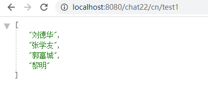

### 2.1、测试场景 1

大家在项目 maven 配置中加入下面内容，然后再试试会输出什么

```java
<!-- 添加jackson配置 -->
<dependency>
    <groupId>com.fasterxml.jackson.core</groupId>
    <artifactId>jackson-core</artifactId>
    <version>2.11.4</version>
</dependency>

<dependency>
    <groupId>com.fasterxml.jackson.core</groupId>
    <artifactId>jackson-databind</artifactId>
    <version>2.11.4</version>
</dependency>

<dependency>
    <groupId>com.fasterxml.jackson.dataformat</groupId>
    <artifactId>jackson-dataformat-xml</artifactId>
    <version>2.11.4</version>
</dependency>
```

浏览器中再次访问，效果如下

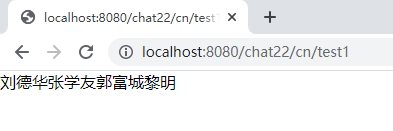

我倒，这是什么玩意啊，有点奇怪啊，浏览器当前页面，点击右键，查看源码，如下，**怎么变成 xml 了啊？？？**


### 2.2、结论 1：返回值受服务器端的影响

从这个上面我们可以看出，我们只是在服务器端调整了一下 maven 的配置，此时接口的返回结果却发生了变化，由 json 格式变成 xml 格式了。

**这里得到第 1 个结论：接口的返回值格式受服务器端的影响。**

### 2.3、测试场景 2

我们在 idea 中使用 Http Client 来访问一下上面这个接口，效果如下，返回的结果依然是 xml 格式的数据。

```
###
GET http://localhost:8080/chat22/cn/test1

```

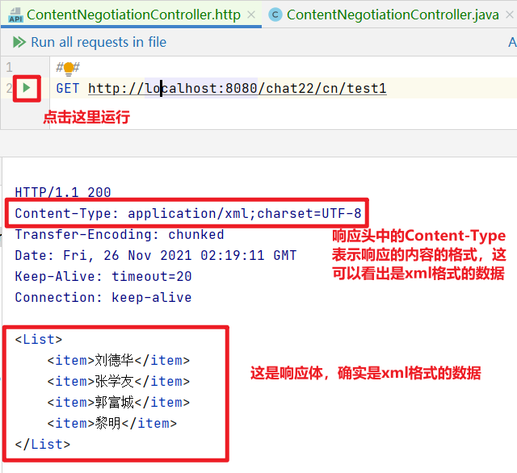

我们调整一下调用的代码，加一行代码，请求中加一个`Accept: application/json`，改成下面这样，然后再次看看效果如下图，这次结果怎么变成 json 了。

```
###
GET http://localhost:8080/chat22/cn/test1
Accept: application/json

```

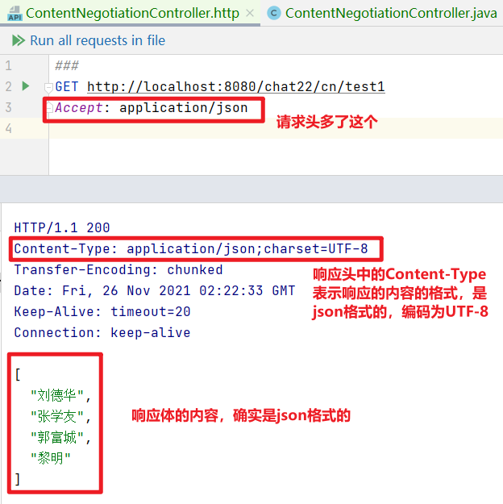

这两次请求唯一不同的地方就是第二次多了`Accept: application/json`这部分代码，然后结果就变成 json 了，说明响应的结果收到了这个头的影响。

咱们再回过头去看一下浏览器的那次请求，它的请求头中的`Accept`是什么样的，如下图，内容我给提取出来了，如下代码，看起来好像很陌生啊，这玩意是啥？稍后我们会详细说明。

```
Accept: text/html,application/xhtml+xml,application/xml;q=0.9,image/avif,image/webp,image/apng,*/*;q=0.8,application/signed-exchange;v=b3;q=0.9

```

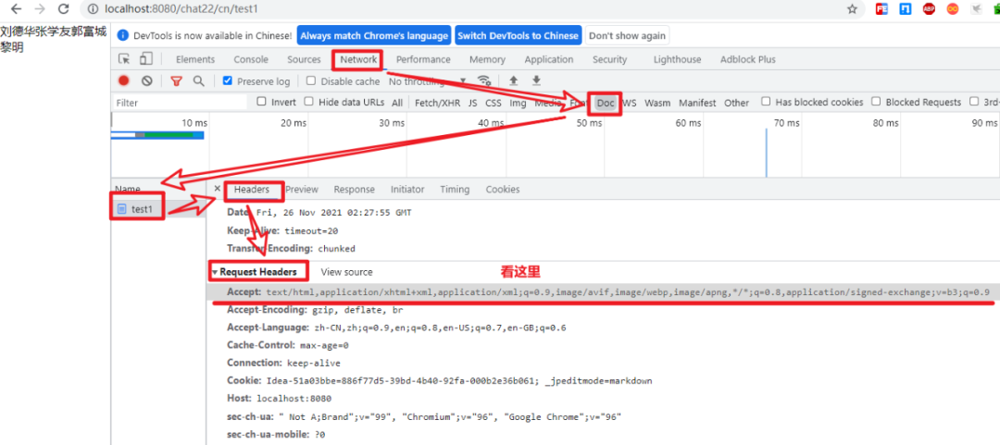

### 2.4、结论 2：返回值受客户端 Accept 头的影响

场景 2 中，我们只是调整了一下 http 请求头中 Accept，响应结果不一样了。

**这里得到第 2 个结论：返回值受客户端 Accept 头的影响。**

### 2.5、小结

从上面可以看出，响应结果的格式受服务器端和客户端的影响，由二者共同决定的。

3、为什么会这样？
---------

### 3.1、这是由类容协商决定的

服务器端和请求端协商决定最终返回什么格式的内容。

客户端发送请求的时候可以告知服务器端，自己希望对方返回的数据格式列表，而服务器端的接口也有自己能够支持的响应格式列表，最终返回结果会根据这 2 个类型列表，找到一种两边都能够支持的类型返回，如果找不到合适，则会报错。

**比如：**服务器端可以响应 json 和 xml 格式的数据，而浏览器发送请求的时候告诉服务器说：我能够接收 html 和 json 格式的数据，那么最终会返回二者都能够支持的类型：json 格式的数据。

**再比如：**服务器端可以响应 json 和 html 格式的数据，而客户端发送 http 请求的时候，说自己希望接受 xml 格式的数据，此时服务器端没有能力返回 xml 格式的数据，最终会报错。

**如果还是不懂，更通俗的解释：**

*   小明找小王介绍女朋友，小明说能满足这些的就可以【有钱、漂亮、幽默】，小王收集了一下身边的资源，发现有钱的、漂亮的没有，幽默的倒是有，然后就将幽默的介绍给小明了，若小王这边没有满足这些条件的，那么就没法给小明介绍女友了。
    
*   小明找小王介绍女朋友，小明说能满足这些的就可以【有钱、漂亮、幽默】，如果都能够满足，那么优先选择有钱的，然后漂亮的，然后幽默的，小王收集了一下身边的资源，发现有钱的、漂亮的、幽默的都有，然后根据小明的需求，将优先级最高的有钱的介绍给他了，小明乐呵呵，哈哈。
    

### 3.2、带来了 2 个问题

*   客户端如何告诉服务器端自己能够接受的内容类型？
    
*   服务器端开发的接口如何指定能够响应的类型？
    

4、客户端如何告诉服务器端自己能够接受的内容类型？
-------------------------

### 4.1、常见 2 种方式

*   方式 1：http 请求头中使用 Accept 来指定客户端能够接收的类型（又叫：媒体类型）
    
*   方式 2：自定义的方式
    
    > 比如请求地址的后缀，test1.xml、test1.json，通过后缀来指定类容类型
    >
    > 比如请求中可以添加一个参数，如 format 来指定能够接收的内容类型
    

这 2 种方式 SpringMVC 中都有实现，SpringMVC 中默认开启了第 1 种方式，而 SpringBoot 中默认开启了这 2 种方式的支持，本文主要讲解第 1 种方式，后续在 SpringBoot 系列中，将详细介绍第 2 种方式。

### 4.2、又带来了 2 个问题

*   问题 1：什么是媒体类型
    
*   问题 2：http 请求头 Accept 是什么样的？
    

5、什么是媒体类型 (MimeType 或 MediaType)？
---------------------------------

### 5.1、解释

简单点理解，媒体类型就是用来表示内容的格式，比如可以用来表示 http 请求体和响应体内容的格式。

**英文称呼：MineType 或者 MediaType**

### 5.2、MimeType 格式

*   格式：type/subtype; 参数 1 = 值 1; 参数 2 = 值 2; 参数 n = 值 n
    
*   type：表示主类型
    
*   subtype：表示子列类型
    
*   类型和参数之间用英文分号隔开
    
*   可以有很多参数，多个参数之间用英文分号隔开
    

### 5.3、常见的 MimeType 举例

<table><thead><tr><th>MimeType</th><th>说明</th></tr></thead><tbody><tr><td>application/json</td><td>表示 json 格式数据</td></tr><tr><td>application/json; charset=UTF-8</td><td>表示 json 格式数据，后面跟了一个编码参数</td></tr><tr><td>text/plain</td><td>表示纯文本格式内容</td></tr><tr><td>text/html</td><td>表示 html 格式内容</td></tr><tr><td>text/html;charset=utf-8</td><td>表示 html，utf-8 编码</td></tr><tr><td>application/json; q=1</td><td>表示 json 格式数据，有个 q 参数，这个参数比较特殊，表示优先级</td></tr></tbody></table>

### 5.4、MimeType 在 http 请求中的应用

#### （1）请求头 Content-type：用来指定请求体中的内容的格式。

> 比如：Content-type: application/json 用来告诉服务器端，客户端请求体的内容是 json 格式的，这样服务器端就可以以 json 格式解析请求体中的内容

#### （2）请求头 Accept：用来告诉服务器，客户端能够接收的媒体类型。

> Accpet 由多个 MimeType 组成，之间用英文逗号隔开。
>
> 比如：Accept:text/html,text/xml,application/json，这个是告诉服务器，客户端可以接收 3 种格式的数据，服务器可以根据自己的能力选择一种格式进行响应

#### （3）响应头 Content-type：用来告知客户端，响应体中的类容是什么格式。

> 比如：Content-type:text/html，表示响应的内容是 html 格式的，此时浏览器就会以 html 显示内容；浏览器会根据不同的格式做出不同的显示效果

#### （4）Http 中的 Content-Type 详解

Http 中的 Content-Type 是一个非常重要的东西，不了解的朋友建议先去这里了解下：http://itsoku.com/article/199

### 5.5、特殊参数 q：指定 MimeType 优先级

当有多个媒体类型在一起的时候，可以在媒体中添加 q 参数用来指定媒体类型的优先级，q 值的范围从 0.0~1.0（1.0 优先级最高）

比如 Http 请求头 Accept 可以指定多个媒体类型，那么可以在媒体类型中加上 q 参数，用来指定媒体类型的优先级，服务器端优先选择媒体类型高的格式进行响应。

> 如：Accept: text/html;q=0.8,text/xml;q=0.6,application/json;q=0.9，这个告知服务器端，客户端希望能够返回这 3 中类型的内容，若服务器端这 3 种都支持，则优先返回 q 值高的类型。

再回头来看看开头的案例，浏览器中看一下这个案例请求头中 Accept 的值

```
Accept: text/html,application/xhtml+xml,application/xml;q=0.9,image/avif,image/webp,image/apng,*/*;q=0.8,application/signed-exchange;v=b3;q=0.9
```

6、http 请求头 Accept 是什么样的？
------------------------

### 6.1、Accept 作用

用来指定客户端能够接收的媒体类型，用来告诉服务器端，客户端希望服务器端返回什么格式的数据

### 6.2、Accept 格式

*   媒体类型 1, 媒体类型 2, 媒体类型 3
    
*   多个媒体之间用逗号隔开
    
*   媒体类型中可以使用 q 参数来标注其优先级，q 值的范围从 0.0~1.0（1.0 优先级最高）
    
    
    

7、Spring 中的类 MediaType 工具类
--------------------------

spring 中为了更方便操作媒体类型，提供了一个工具类`org.springframework.http.MediaType`，`MediaType`内部提供了很多常见的 MediaType 常量和常用的方法。

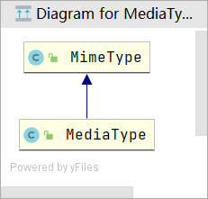

### 7.1、常见常量

```java
public static final String APPLICATION_JSON_VALUE = "application/json"; //json
public static final String TEXT_PLAIN_VALUE = "text/plain"; //文本
public static final String TEXT_HTML_VALUE = "text/html"; //html
public static final String APPLICATION_XML_VALUE = "application/xml"; //xml
public static final String IMAGE_GIF_VALUE = "image/gif"; //gif图片
public static final String IMAGE_JPEG_VALUE = "image/jpeg"; //jpeg图片
public static final String APPLICATION_PDF_VALUE = "application/pdf";//pdf格式
public static final String APPLICATION_FORM_URLENCODED_VALUE = "application/x-www-form-urlencoded"; //普通表单提交内容的格式
public static final String MULTIPART_FORM_DATA_VALUE = "multipart/form-data";//上传文件表单提交的内容格式
```

### 7.2、常用的方法

<table><thead><tr><th>方法</th><th>说明</th></tr></thead><tbody><tr><td>static MediaType parseMediaType(String mediaType)</td><td>将文本解析为 MediaType</td></tr><tr><td>static List&lt;MediaType&gt; parseMediaTypes(@Nullable String mediaTypes)</td><td>将文本解析为 MediaType 列表</td></tr><tr><td>static String toString(Collection&lt;MediaType&gt; mediaTypes)</td><td>将 MediaType 列表解析为字符串</td></tr><tr><td>static void sortBySpecificityAndQuality(List&lt;MediaType&gt; mediaTypes)</td><td>将多个 MediaType 进行排序，内部会按照 q 参数排序</td></tr><tr><td>boolean includes(@Nullable MediaType other)</td><td>判断当前的 MediaType 是否包含了参数中指定的 other，比如当前的是：*/*，这是一个通配符类型的，那么可以匹配一切类型</td></tr></tbody></table>

### 7.3、排序规则

SpringMVC 内部会根据客户端 Accept 指定的媒体类型列表以及服务器端接口能够支持的媒体类型列表，处理之后得到一个双方都支持的媒体类型列表，然后调用`MediaType#sortBySpecificityAndQuality`方法进行升序排序，最终会选择优先级最高的来返回。

我们来分析下开头案例为什么返回的是 xml 格式的数据

浏览器发送的 Accept：

```
Accept: text/html,application/xhtml+xml,application/xml;q=0.9,image/avif,image/webp,image/apng,*/*;q=0.8,application/signed-exchange;v=b3;q=0.9
```

服务器端的那个接口支持的媒体类型：

```
application/xml;charset=UTF-8, text/xml;charset=UTF-8, application/*+xml;charset=UTF-8, application/json, application/*+json
```

二者取交集，最终得到双方都支持的媒体类型：

```
application/xhtml+xml, application/xml;charset=UTF-8;q=0.9, application/xml;q=0.9, application/xml;charset=UTF-8;q=0.8, text/xml;charset=UTF-8;q=0.8, application/*+xml;charset=UTF-8;q=0.8, application/json;q=0.8, application/*+json;q=0.
```

然后调用`MediaType#sortBySpecificityAndQuality`方法排序，得到

> **小提示**：排序规则：类型的在前面，通配符 * 的在后面，q 大的在前，如果没有指定 q，则表示 q 为 1

```
application/xhtml+xml, application/xml;charset=UTF-8;q=0.9, application/xml;q=0.9, application/xml;charset=UTF-8;q=0.8, text/xml;charset=UTF-8;q=0.8, application/json;q=0.8, application/*+xml;charset=UTF-8;q=0.8, application/*+json;q=0.8
```

然后取第一个作为最终返回的类型：

```
Content-Type: application/xhtml+xml;charset=UTF-8
```

如下图，确实和浏览器中的结果一致

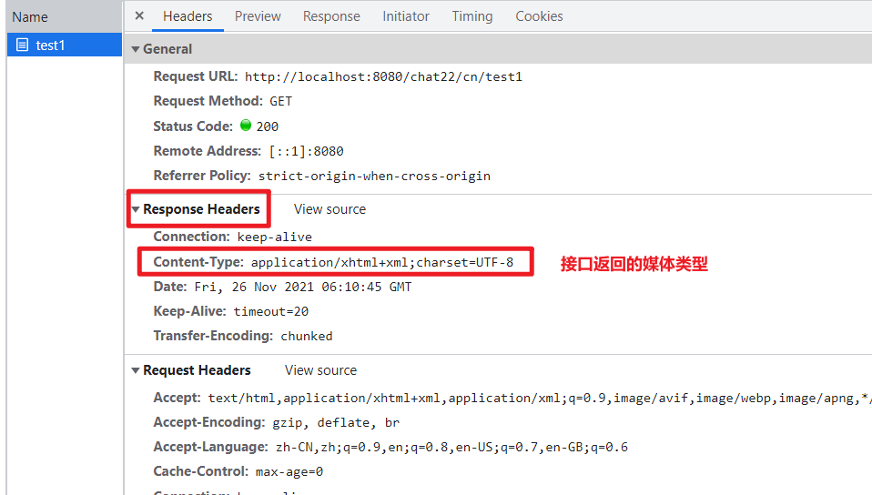

8、服务端可响应的媒体类型
-------------

### 8.1、服务端有 3 种方式可以指定响应的媒体类型

*   **方式 1**：@RequestMapping 注解的 produces 属性
    
*   **方式 2**：response.setHeader("Content-Type","媒体类型");
    
*   **方式 3**：如果上面 2 种方式都不指定，则由 SpringMVC 内部机制自动确定能够响应的媒体类型列表
    

### 8.2、方式 1：@RequestMapping 注解的 produces 属性

#### （1）解释

@RequestMapping 注解有个 produces 属性，用来指定当前接口能够响应的媒体类型，也可以理解为此接口可以处理的媒体类型，其他的一些注解`@PostMapping/@GettMapping/@PutMapping/@DeleteMapping/@PatchMapping/@PatchMapping`也有这个属性，作用一样的；这里以 @RequestMapping 注解有个 produces 属性来做说明。

#### （2）案例

比如要求接口只能返回 json 格式的数据，那么可以这么写

```java
@RequestMapping(value = "/cn/test1", produces = {"application/json"})
@ResponseBody
public List<String> testProduct() {
    List<String> result = Arrays.asList(
            "刘德华",
            "张学友",
            "郭富城",
            "黎明");
    return result;
}
```

**测试场景 1**：浏览器直接访问，返回的是 json 格式数据

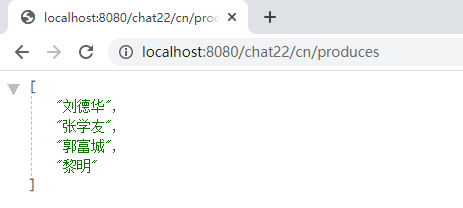

**测试场景 2**：头 Accept 指定为 applicaiton/xml，出现了 406，服务器端无法处理，那是因为客户单希望服务器端返回`application/xml`格式数据，而服务器端接口只能返回`application/json`格式的数据，请求还没有到达接口内部，就被 springmvc 拦截了，给拒绝了

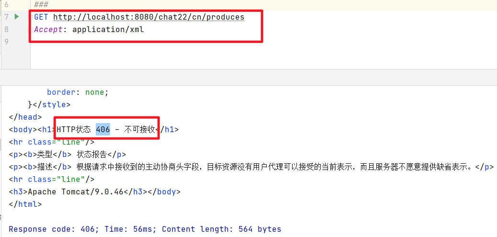

### 8.3、方式 2：response.setHeader("Content-Type","媒体类型");

这种方式是直接忽略你客户端的要求，不管客户端的 Accept 是什么，服务器端都直接返回指定的类型，比如下面这段代码，不管客户端的 Accept 是什么值，最终都只会返回 xml 格式的数据。

```
@RequestMapping(value = "/cn/contenttype")
public void testContentType(HttpServletResponse response) throws IOException {
    //指定了响应的结果的类型
    response.setHeader("Content-Type", "application/xml");
    response.getWriter().write(
            "<List>" +
                    "<item>刘德华</item>" +
                    "<item>张学友</item>" +
                    "<item>郭富城</item>" +
                    "<item>黎明</item>" +
                    "</List>");
    response.getWriter().flush();
}
```

### 8.4、方式 3：由 SpringMVC 内部机制自动确定能够响应的媒体类型列表

如下代码，这段代码就由 SpringMVC 内部结合请求头中的 Accpet 协商得到最终返回的媒体类型。

```java
@RequestMapping(value = "/cn/auto")
@ResponseBody
public List<String> testAuto(HttpServletResponse response) throws IOException {
    List<String> result = Arrays.asList(
            "刘德华",
            "张学友",
            "郭富城",
            "黎明");
    return result;
}
```

比如，你 Accept 传递的是 application/xml，表示客户端希望返回 xml 格式的数据。

Aceept 传递的是 application/json，表示客户端希望返回 json 格式的数据，那么返回但就是 json 格式的数据。

**这个代码带来了一个问题：这段代码能够响应的媒体类型有哪些呢？这个问题大家有没有思考过**

方法或者类上标注有`@ResponseBody`注解，通常这个接口的返回值会被 SpringMVC 中的`org.springframework.web.servlet.mvc.method.annotation.RequestResponseBodyMethodProcessor#handleReturnValue`这个方法处理。

这个方法内部会找到当前 SpringMVC 容器中的所有消息转换器（`org.springframework.http.converter.HttpMessageConverter`），消息转换器中有个`getSupportedMediaTypes`方法。

```java
List<MediaType> getSupportedMediaTypes();
```

这个方法会返回当前转换器能够支持的媒体类型，表示这个转换器能能够将内容转换为这些媒体类型格式的数据然后响应到客户端，比如上面接口的返回值是一个 List，然后丢给 xml 的 HttpMessageConverter，就会被转换为 xml 格式的数据输出到客户端。

SpringMVC 会调用这些 HttpMessageConverter 的`getSupportedMediaTypes`方法得到一个媒体类型列表，这个列表就是当前接口可以相应的媒体类型。

然后结合 http 头中的 Accept，得到一个最终双方都可以接受的媒体类型。

然后就进行排序。

然后取最优的一个，通常是排序后的第一个，作为最终响应的媒体类型，这个媒体类型会对应一个 HttpMessageConverter，然后使用 HttpMessageConverter 将接口的返回值转换为指定的媒体类型格式的数据，比如 xml 格式、json 格式等等，然后输出到响应体中。

### 8.5、方式 3 源码解读

方式 3 是最常用的方式，其次是方式 1，方式 2 用的比较少，这里我们来解读一下方式 3 的源码，以便加深理解。

#### 方式 3 中会涉及到内容的协商，过程大致如下

*   step1：获取客户端能够接收的媒体类型列表：由请求头 Accpet 解析得到
    
*   step2：获取服务器端能够响应的媒体类型列表：遍历所有 HttpMessageConverter 的`getSupportedMediaTypes`方法得到一个媒体类型列表
    
*   step3：根据双方支持的媒体类型列表，得到双方都认可媒体类型列表
    
*   step4：对 step 中得到的双方都支持的媒体类型列表进行排序
    
*   step5：取一个合适的作为响应的媒体类型
    
*   step6：根据接口的返回值和 step5 得到的 MediaType，匹配到合适 HttpMessageConverter，然后调用 HttpMessageConverter 的 write 方法，其内部将内容转换为指定的格式输出
    

这个过程所在的代码在下面这个方法中，大家可以设置断点，然后去请求方式 3 中的`/cn/auto`接口，会进入到这个方法中。

```
org.springframework.web.servlet.mvc.method.annotation.AbstractMessageConverterMethodProcessor#writeWithMessageConverters(T, org.springframework.core.MethodParameter, org.springframework.http.server.ServletServerHttpRequest, org.springframework.http.server.ServletServerHttpResponse)
```

#### step1：获取客户端支持的媒体类型列表

> 获取客户端能够接收的媒体类型列表：由请求头 Accpet 解析得到

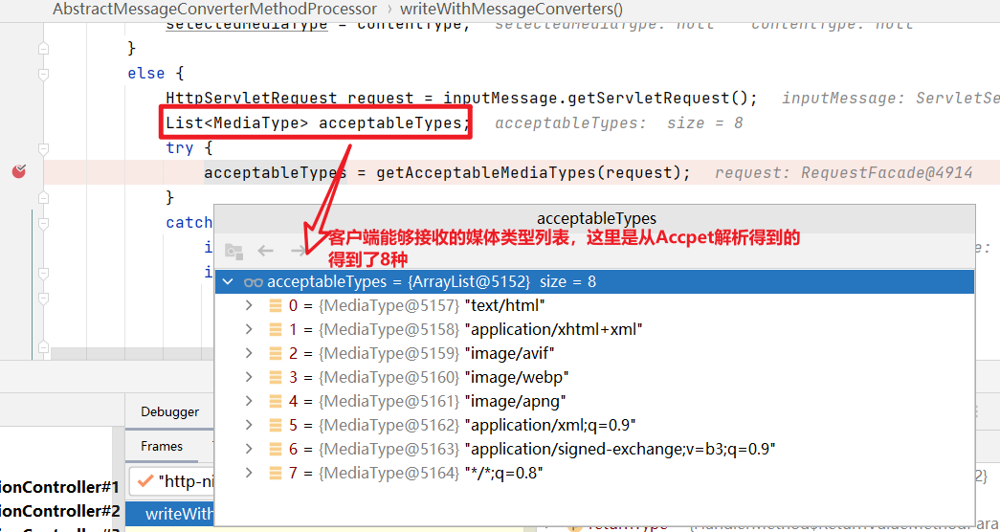

#### step2：获取服务器端能够响应的媒体类型列表

对应的代码如下

```java
List<MediaType> producibleTypes = getProducibleMediaTypes(request, valueType, targetType);
```

下面进入`getProducibleMediaTypes`方法

```java
protected List<MediaType> getProducibleMediaTypes(
    HttpServletRequest request, Class<?> valueClass, @Nullable Type targetType) {
 //这个是从@RquestMapping的produces属性中取值，如果有就直接取这个的值
    Set<MediaType> mediaTypes =
        (Set<MediaType>) request.getAttribute(HandlerMapping.PRODUCIBLE_MEDIA_TYPES_ATTRIBUTE);
    if (!CollectionUtils.isEmpty(mediaTypes)) {
        return new ArrayList<>(mediaTypes);
    }
    //遍历HttpMessageConverter,调用其canWrite方法判断是否能够处理当前接口方法的返回值，比如当前接口是List<String>
    //若可以处理，则调用其getSupportedMediaTypes方法，得到媒体类型列表
    List<MediaType> result = new ArrayList<>();
    for (HttpMessageConverter<?> converter : this.messageConverters) {
        if (converter instanceof GenericHttpMessageConverter && targetType != null) {
            if (((GenericHttpMessageConverter<?>) converter).canWrite(targetType, valueClass, null)) {
                result.addAll(converter.getSupportedMediaTypes(valueClass));
            }
        }
        else if (converter.canWrite(valueClass, null)) {
            result.addAll(converter.getSupportedMediaTypes(valueClass));
        }
    }
    //如果上面的媒体类型为空，则返回*/*媒体类型，否则返回找到的媒体类型列表
    return (result.isEmpty() ? Collections.singletonList(MediaType.ALL) : result);
}

```

HttpMessageConverter 我们截图看一下，这里有 8 个

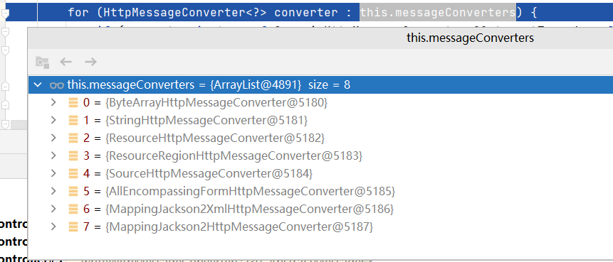

<table><thead><tr><th>HttpMessageConverter</th><th>支持的 MediaType</th><th>支持的接口返回值类型</th><th>说明</th></tr></thead><tbody><tr><td>StringHttpMessageConverter</td><td>text/plain,*/*</td><td>String</td><td>返回纯文本</td></tr><tr><td>ByteArrayHttpMessageConverter</td><td>application/octet-stream</td><td>byte[]</td><td>返回字节流</td></tr><tr><td>FormHttpMessageConverter</td><td>application/x-www-form-urlencoded<br>multipart/form-data<br>multipart/mixed</td><td>MultiValueMap&lt;String, ?&gt;</td><td>将内容以表单提交的内容格式输出</td></tr><tr><td>ResourceHttpMessageConverter</td><td>*/*</td><td>org.springframework.core.io.Resource</td><td>Resource 用来表示各种资源，这种可以用来下载文件</td></tr><tr><td>MappingJackson2HttpMessageConverter</td><td>application/json<br>application/*+json</td><td>能够被 jackson 工具转换为 json 格式的类型都行</td><td>响应 json 用的就是这个</td></tr><tr><td>MappingJackson2XmlHttpMessageConverter</td><td>application/xml<br>text/xml<br>application/*+xml</td><td>能够被 jackson xml 工具转换为 xml 格式的类型都行</td><td>响应 xml 用的就是这个</td></tr></tbody></table>

上面列表中的最后 2 个 Converter 在下面这些包中，所以加了这些配置之后，SpringMVC 才有了处理 json 和 xml 的能力，这里也算是解答了本文开头的问题。

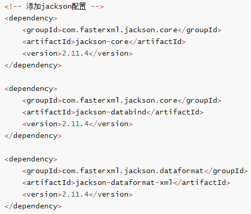

getProducibleMediaTypes 方法执行完毕之后，得到了服务器端能够响应的媒体类型列表


#### step3：根据双方支持的媒体类型列表，得到双方都认可媒体类型列表


#### step4：对 step 中得到的双方都支持的媒体类型列表进行排序


#### step5：取一个合适的作为响应的媒体类型

> 如下，会遍历排序好的列表，然后进行遍历，取第一个具体的媒体类型，`mediaType.isConcrete()`用来爬的南是不是具体的类型，具体的类型就是内部不包含通配符 * 的类型

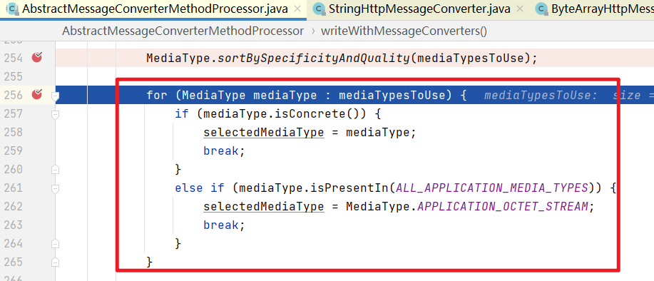

#### step6：匹配到合适的 HttpMessageConverter，将结果转换为指定的格式输出

代码如下，根据接口的返回值和 step5 得到的 MediaType，匹配到合适 HttpMessageConverter，然后调用 HttpMessageConverter 的 write 方法，其内部将内容转换为指定的格式输出

```java
if (selectedMediaType != null) {
    selectedMediaType = selectedMediaType.removeQualityValue();
    for (HttpMessageConverter<?> converter : this.messageConverters) {
        GenericHttpMessageConverter genericConverter = (converter instanceof GenericHttpMessageConverter ?
                                                        (GenericHttpMessageConverter<?>) converter : null);
        if (genericConverter != null ?
            ((GenericHttpMessageConverter) converter).canWrite(targetType, valueType, selectedMediaType) :
            converter.canWrite(valueType, selectedMediaType)) {
            body = getAdvice().beforeBodyWrite(body, returnType, selectedMediaType,
                                               (Class<? extends HttpMessageConverter<?>>) converter.getClass(),
                                               inputMessage, outputMessage);
            if (body != null) {
                Object theBody = body;
                LogFormatUtils.traceDebug(logger, traceOn ->
                                          "Writing [" + LogFormatUtils.formatValue(theBody, !traceOn) + "]");
                addContentDispositionHeader(inputMessage, outputMessage);
                if (genericConverter != null) {
                    genericConverter.write(body, targetType, selectedMediaType, outputMessage);
                }
                else {
                    ((HttpMessageConverter) converter).write(body, selectedMediaType, outputMessage);
                }
            }
            else {
                if (logger.isDebugEnabled()) {
                    logger.debug("Nothing to write: null body");
                }
            }
            return;
        }
    }
}

```

9、总结
----

本文的内容是非常非常重要的一个知识点，建议大家多看 2 遍，敲一敲 + debug，测试测试，掌握就比较容易了；掌握这些之后才能更好的用好 SpringMVC 和 SpringBoot。

10、案例代码 git 地址
--------------

### 10.1、git 地址

https://gitee.com/javacode2018/springmvc-series


### 10.2、本文案例代码结构说明

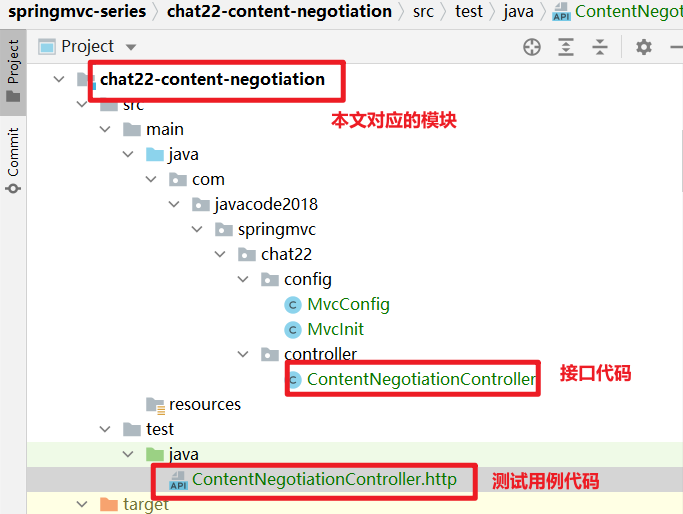

