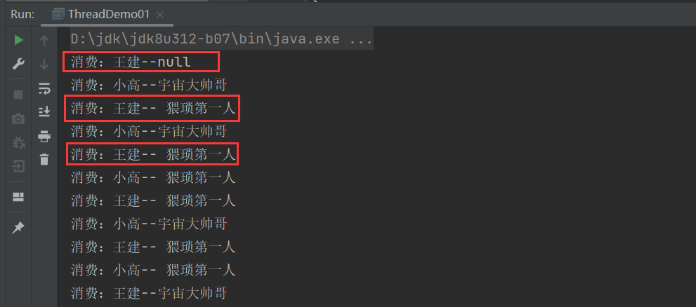
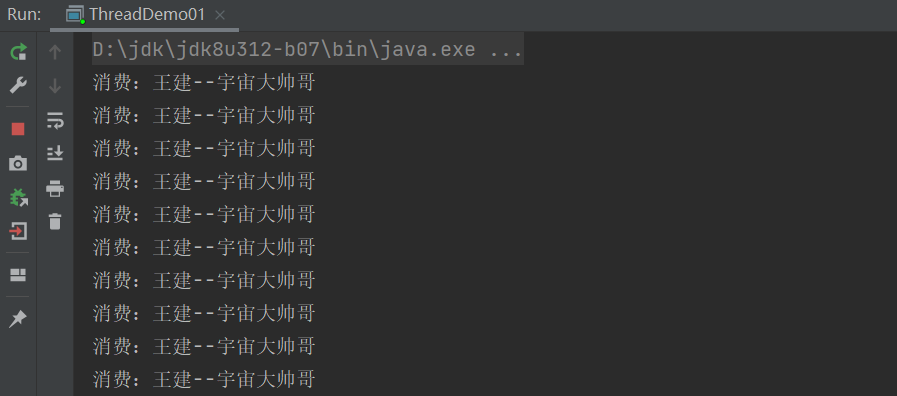

## 简介

### 1、具体内容：

在多线程的开发过程之中最为著名的案例就是生产者与消费者操作，该操作的主要流程如下：

1. 生产者负责信息内容的生产;
2. 每当生产者生产完成一项完整的信息之后消费者要从这里面取走信息;
3. 如果生产者没有生产者则消费者要等待它生产完成，如果消费者还没有对信息进行消费，则生产者应该等待消费处理完成后再继续进行生产。


### 2、程序的基本实现

可以将生产者与消费者定义为两个独立的线程类对象，但是对于现在生产的数据，可以使用如下的组成：

-  数据一: title = 王建、content = 宇宙大帅哥;
- 数据二: title = 小高、content = 猥琐第一人;


既然生产者与消费者是两个独立的线程，那么这两个独立的线程之间就需要有一个数据的保存集中点，那么可以单独定义一个 Message 类实现数据的保存。


生产者与消费者


范例: 程序基本结构

```java
package com.hanliukui;

class Message{

    private String title;
    private String content;

    public String getTitle() {
        return title;
    }

    public void setTitle(String title) {
        this.title = title;
    }

    public String getContent() {
        return content;
    }

    public void setContent(String content) {
        this.content = content;
    }
}


class Producer implements Runnable{
    private Message message;

    public Producer(Message message){
        this.message = message;
    }

    @Override
    public void run() {
        for (int i = 0; i < 100; i++) {

            try {
                if (i % 2==0) {
                    message.setTitle("王建");

                    Thread.sleep(1000);
                    message.setContent("宇宙大帅哥");
                }else {
                    message.setTitle("小高");

                    Thread.sleep(1000);
                    message.setContent(" 猥琐第一人");
                }
            } catch (InterruptedException e) {
                e.printStackTrace();
            }
        }
    }
}

class Consumer implements Runnable{

    private Message message;

    public Consumer(Message message){
        this.message = message;
    }

    @Override
    public void run() {
        for (int i = 0; i < 100; i++) {
            try {
                String title = message.getTitle();
                Thread.sleep(1000);
                String content = message.getContent();
                System.out.println("消费："+title+"--"+content);
            } catch (InterruptedException e) {
                e.printStackTrace();
            }

        }
    }

}

public class ThreadDemo01 {

    public static void main(String[] args) {
        Message message = new Message();
        new Thread(new Producer(message)).start();
        new Thread(new Consumer(message)).start();
    }

}
```



通过整个代码的执行你会发现此时有两个主要问题：

- 问题一：数据不同步了;
- 问题二： 生产一个取走一个，但是发现有了重复生产和重复取出问题。


## 解决生产者 - 消费者同步问题


### 解决数据同步

如果要解决问题，首先解决的就是数据同步的处理问题，如果要想解决数据同步最简单的做法是使用 synchronized 关键字定义同步代码块或同步方法，于是这个时候对于同步的处理就可以直接在 Message 类中完成。


范例: 解决同步操作

```java
package com.hanliukui;

class Message{

    private String title;
    private String content;

    public synchronized void set(String title,String content){
        this.title=title;
        this.content=content;
    }

    public synchronized String get() {
        return title+"--"+content;
    }

}


class Producer implements Runnable{
    private Message message;

    public Producer(Message message){
        this.message = message;
    }

    @Override
    public void run() {
        for (int i = 0; i < 100; i++) {
            try {
                if (i % 2==0) {
                    message.set("王建","宇宙大帅哥");
                    Thread.sleep(1000);
                }else {
                    Thread.sleep(1000);
                    message.set("小高","猥琐第一人");
                }
            } catch (InterruptedException e) {
                e.printStackTrace();
            }
        }
    }
}

class Consumer implements Runnable{

    private Message message;

    public Consumer(Message message){
        this.message = message;
    }

    @Override
    public void run() {
        for (int i = 0; i < 100; i++) {
            try {
                String message = this.message.get();
                Thread.sleep(1000);
                System.out.println("消费："+message);
            } catch (InterruptedException e) {
                e.printStackTrace();
            }
        }
    }

}

public class ThreadDemo01 {

    public static void main(String[] args) {
        Message message = new Message();
        new Thread(new Producer(message)).start();
        new Thread(new Consumer(message)).start();
    }

}
```



在进行同步处理的时候肯定需要有一个同步的处理对象，那么此时肯定要将同步操作交由 Message 类处理是最合适的。


这个时候发现数据已经可以正常的保持一致了，但是对于重复操作的问题依然存在。

## 等待与唤醒机制

如果说现在要想解决生产者与消费者的问题，那么最好的解决方案就是使用等待与唤醒机制，而对于等待与唤醒的操作机制，主要依靠的是 Object 类中提供的方法处理的。

### 利用 Object 类解决重复操作


### 线程等待与唤醒


如果说现在要想解决生产者与消费者的问题，那么最好的解决方案就是使用等待与. 唤醒机制，而对于等待与唤醒的操作机制，主要依靠的是 Object 类中提供的方法处理的:

```java
// 等待
public final void wait() throws InterruptedException; //死等
public final void wait(long timeout) throws InterruptedException; //设置等待时间
public final void wait(long timeout, int nanos) throws InterruptedException; //设置等待时间
public final void notify(); // 唤醒第一个等待线程
public final void notifyAll(); // 唤醒全部等待线程
```

如果此时有若干个等待线程的话，那么 `notify()`表示的是唤醒第一个等待的，而其它的线程继续等待. 而 `notifyAll()`表示醒所有等待的线程，哪个线程的优先级高就有可能先执行。


对于当前的问题主要的解决应该通过 Message 类完成处理。


**范例: 修改 Message 类：**

```java
package com.hanliukui;

class Message {

    private String title;
    private String content;
    // 用来标记状态，
    // true 可以消费，不能生产
    // false 可以生产，不能消费
    private boolean flag = false;

    public synchronized void set(String title, String content) {
        try {
            if (flag) {
                super.wait();
            } else {
                Thread.sleep(1000);
                this.title = title;
                this.content = content;
                System.out.println("生产："+title+"--"+content);
                flag = true;
                super.notify();
            }
        } catch (InterruptedException e) {
            e.printStackTrace();
        }
    }

    public synchronized void get() {
        try {
            if (flag) {
                Thread.sleep(1000);
                System.out.println("消费："+title + "--" + content);
                flag = false;
                super.notify();
            } else {
                super.wait();
            }
        } catch (InterruptedException e) {
            e.printStackTrace();
        }
    }
}


class Producer implements Runnable {
    private Message message;

    public Producer(Message message) {
        this.message = message;
    }

    @Override
    public void run() {
        for (int i = 0; i < 100; i++) {
            if (i % 2 == 0) {
                message.set("王建"+i, "宇宙大帅哥");
            } else {
                message.set("小高"+i, "猥琐第一人");
            }
        }
    }
}

class Consumer implements Runnable {

    private Message message;

    public Consumer(Message message) {
        this.message = message;
    }

    @Override
    public void run() {
        for (int i = 0; i < 100; i++) {
            this.message.get();
        }
    }

}

public class ThreadDemo01 {

    public static void main(String[] args) {
        Message message = new Message();
        new Thread(new Producer(message)).start();
        new Thread(new Consumer(message)).start();
    }

}
```


注：这种处理形式就是在进行多线程开发过程之中最原始的处理方案，整个的等待、同步唤醒机制都有开发者自行通过原生代码实现控制。